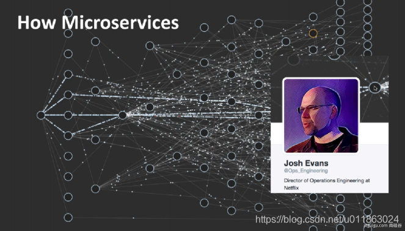
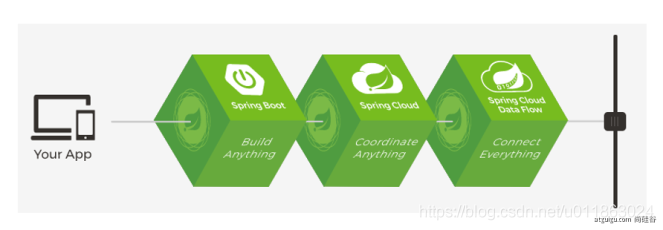

## 01、基础入门-SpringBoot2课程介绍

1. Spring Boot 2核心技术

2. Spring Boot 2响应式编程

- 学习要求
  -熟悉Spring基础
  -熟悉Maven使用
- 环境要求
    - Java8及以上
    - Maven 3.3及以上
- 学习资料
    - [Spring Boot官网](https://spring.io/projects/spring-boot)
    - [Spring Boot官方文档](https://docs.spring.io/spring-boot/docs/)
    - [本课程文档地址](https://www.yuque.com/atguigu/springboot)
    - [视频地址1](http://www.gulixueyuan.com/)、[视频地址2](https://www.bilibili.com/video/BV19K4y1L7MT?p=1)
    - [源码地址](https://gitee.com/leifengyang/springboot2)

## 02、基础入门-Spring生态圈

[Spring官网](https://spring.io/)

### Spring能做什么

#### Spring的能力


#### Spring的生态

覆盖了：

- web开发
- 数据访问
- 安全控制
- 分布式
- 消息服务
- 移动开发
- 批处理
- ......

#### Spring5重大升级

- 响应式编程


- 内部源码设计

基于Java8的一些新特性，如：接口默认实现。重新设计源码架构。


### 为什么用SpringBoot

> Spring Boot makes it easy to create stand-alone, production-grade Spring based Applications that you can "just run".[link](https://spring.io/projects/spring-boot)
>
> 能快速创建出生产级别的Spring应用。

#### SpringBoot优点

- Create stand-alone Spring applications
    - 创建独立Spring应用
- Embed Tomcat, Jetty or Undertow directly (no need to deploy WAR files)
    - 内嵌web服务器
- Provide opinionated 'starter' dependencies to simplify your build configuration
    - 自动starter依赖，简化构建配置
- Automatically configure Spring and 3rd party libraries whenever possible
    - 自动配置Spring以及第三方功能
- Provide production-ready features such as metrics, health checks, and externalized configuration
    - 提供生产级别的监控、健康检查及外部化配置
- Absolutely no code generation and no requirement for XML configuration
    - 无代码生成、无需编写XML


- SpringBoot是整合Spring技术栈的一站式框架
- SpringBoot是简化Spring技术栈的快速开发脚手架


#### SpringBoot缺点

- 人称版本帝，迭代快，需要时刻关注变化
- 封装太深，内部原理复杂，不容易精通

## 03、基础入门-SpringBoot的大时代背景

### 微服务

> In short, the **microservice architectural style** is an approach to developing a single application as a **suite of small services**, each **running in its own process** and communicating with **lightweight** mechanisms, often an **HTTP** resource API. These services are built around **business capabilities** and **independently deployable** by fully **automated deployment** machinery. There is a bare minimum of centralized management of these services, which may be **written in different programming languages** and use different data storage technologies.——[James Lewis and Martin Fowler (2014)](https://martinfowler.com/articles/microservices.html)

- 微服务是一种架构风格
- 一个应用拆分为一组小型服务
- 每个服务运行在自己的进程内，也就是可独立部署和升级
- 服务之间使用轻量级HTTP交互
- 服务围绕业务功能拆分
- 可以由全自动部署机制独立部署
- 去中心化，服务自治。服务可以使用不同的语言、不同的存储技术

### 分布式


#### 分布式的困难

- 远程调用
- 服务发现
- 负载均衡
- 服务容错
- 配置管理
- 服务监控
- 链路追踪
- 日志管理
- 任务调度
- ......

#### 分布式的解决

- SpringBoot + SpringCloud



### 云原生

原生应用如何上云。 Cloud Native

#### 上云的困难

- 服务自愈
- 弹性伸缩
- 服务隔离
- 自动化部署
- 灰度发布
- 流量治理
- ......

#### 上云的解决


## 04、基础入门-SpringBoot官方文档架构

- [Spring Boot官网](https://spring.io/projects/spring-boot)
- [Spring Boot官方文档](https://docs.spring.io/spring-boot/docs/)

### 官网文档架构


[查看版本新特性](https://github.com/spring-projects/spring-boot/wiki#release-notes)


## 05、基础入门-SpringBoot-HelloWorld

### 系统要求

- Java 8
- Maven 3.3+
- IntelliJ IDEA 2019.1.2

#### Maven配置文件

新添内容：

```xml
<mirrors>
	<mirror>
		<id>nexus-aliyun</id>
		<mirrorOf>central</mirrorOf>
		<name>Nexus aliyun</name>
		<url>http://maven.aliyun.com/nexus/content/groups/public</url>
	</mirror>
</mirrors>

<profiles>
	<profile>
		<id>jdk-1.8</id>

		<activation>
			<activeByDefault>true</activeByDefault>
			<jdk>1.8</jdk>
		</activation>

		<properties>
			<maven.compiler.source>1.8</maven.compiler.source>
			<maven.compiler.target>1.8</maven.compiler.target>
			<maven.compiler.compilerVersion>1.8</maven.compiler.compilerVersion>
		</properties>
	</profile>
</profiles>
```

### HelloWorld项目

需求：浏览发送/hello请求，响应 “Hello，Spring Boot 2”

#### 创建maven工程


#### 引入依赖

```xml
<parent>
	<groupId>org.springframework.boot</groupId>
	<artifactId>spring-boot-starter-parent</artifactId>
	<version>2.3.4.RELEASE</version>
</parent>

<dependencies>
	<dependency>
		<groupId>org.springframework.boot</groupId>
		<artifactId>spring-boot-starter-web</artifactId>
	</dependency>
</dependencies>
```

#### 创建主程序

```java
import org.springframework.boot.SpringApplication;
import org.springframework.boot.autoconfigure.SpringBootApplication;

@SpringBootApplication
public class MainApplication {

    public static void main(String[] args) {
        SpringApplication.run(MainApplication.class, args);
    }
}

```

#### 编写业务

```java
import org.springframework.web.bind.annotation.RequestMapping;
import org.springframework.web.bind.annotation.RestController;

@RestController
public class HelloController {
    @RequestMapping("/hello")
    public String handle01(){
        return "Hello, Spring Boot 2!";
    }
}
```

#### 运行&测试

- 运行`MainApplication`类
- 浏览器输入`http://localhost:8888/hello`，将会输出`Hello, Spring Boot 2!`。

#### 设置配置

maven工程的resource文件夹中创建application.properties文件。

```properties
# 设置端口号
server.port=8888
```

[更多配置信息](https://docs.spring.io/spring-boot/docs/2.3.7.RELEASE/reference/html/appendix-application-properties.html#common-application-properties-server)

#### 打包部署

在pom.xml添加

```xml
<build>
	<plugins>
		<plugin>
			<groupId>org.springframework.boot</groupId>
			<artifactId>spring-boot-maven-plugin</artifactId>
		</plugin>
	</plugins>
</build>
```

在IDEA的Maven插件上点击运行 clean 、package，把helloworld工程项目的打包成jar包，

打包好的jar包被生成在helloworld工程项目的target文件夹内。

用cmd运行`java -jar 01_springboot_helloWorld-1.0-SNAPSHOT.jar`，既可以运行helloworld工程项目。

将jar包直接在目标服务器执行即可。

## 06、基础入门-SpringBoot-依赖管理特性

- 父项目做依赖管理

```xml
依赖管理
<parent>
	<groupId>org.springframework.boot</groupId>
	<artifactId>spring-boot-starter-parent</artifactId>
	<version>2.3.4.RELEASE</version>
</parent>

上面项目的父项目如下，spring-boot-dependencies 几乎声明了所有开发中常用的依赖的版本号，自动版本仲裁机制
<parent>
	<groupId>org.springframework.boot</groupId>
	<artifactId>spring-boot-dependencies</artifactId>
	<version>2.3.4.RELEASE</version>
</parent>
```

- 开发导入starter场景启动器
  1. 见到很多 spring-boot-starter-* ： *就代表某种场景
  2. 只要引入starter，这个场景的所有常规需要的依赖我们都自动引入
  3. [更多SpringBoot所有支持的场景](https://docs.spring.io/spring-boot/docs/current/reference/html/using-spring-boot.html#using-boot-starter)
  4. 见到的  *-spring-boot-starter： 第三方为我们提供的简化开发的场景启动器。

```xml
所有场景启动器最底层的依赖
<dependency>
	<groupId>org.springframework.boot</groupId>
	<artifactId>spring-boot-starter</artifactId>
	<version>2.3.4.RELEASE</version>
	<scope>compile</scope>
</dependency>
```

- 无需关注版本号，自动版本仲裁
  1. 引入依赖默认都可以不写版本
  2. 引入非版本仲裁的jar，要写版本号。

- 可以修改默认版本号
  1. 查看spring-boot-dependencies里面规定当前依赖的版本用的key。
  2. 在当前项目里面重写配置，如下面的代码。

```xml
<properties>
	<mysql.version>5.1.43</mysql.version>
</properties>
```

---

IDEA快捷键：
- `ctrl + shift + alt + U`：等同于pom文件中鼠标右键"Diagrams - Show Dependencies"，以树状结构图的方式显示项目的依赖的关系。


## 07、基础入门-SpringBoot-自动配置特性


- 自动配好Tomcat
  - 引入Tomcat依赖。
  - 配置Tomcat

```xml
<dependency>
	<groupId>org.springframework.boot</groupId>
	<artifactId>spring-boot-starter-tomcat</artifactId>
	<version>2.3.4.RELEASE</version>
	<scope>compile</scope>
</dependency>
```

- 自动配好SpringMVC
  - 引入SpringMVC全套组件
  - 自动配好SpringMVC常用组件（功能）

- 自动配好Web常见功能，如：字符编码问题
  - SpringBoot帮我们配置好了所有web开发的常见场景

```java
@SpringBootApplication
public class MainApplication {

    public static void main(String[] args) {
        //1、返回我们IOC容器
        ConfigurableApplicationContext run = SpringApplication.run(MainApplication.class, args);

        //2、查看并打印容器里面的所有组件bean名
        String[] names = run.getBeanDefinitionNames();
        for (String name : names) {
            System.out.println(name);
        }
    }
}
```

- 默认的包结构
  - 主程序所在包及其下面的所有子包里面的组件都会被默认扫描进来
  - 无需以前的包扫描配置
  - 想要改变扫描路径
    - @SpringBootApplication(scanBasePackages="com.atguigu")
    - @ComponentScan 指定扫描路径

```java
@SpringBootApplication
等同于
@SpringBootConfiguration
@EnableAutoConfiguration
@ComponentScan("com.atguigu")
```

- 各种配置拥有默认值
  - 默认配置最终都是映射到某个类上，如：`MultipartProperties`
  - 配置文件的值最终会绑定每个类上，这个类会在容器中创建对象

- 按需加载所有自动配置项
  - 非常多的starter
  - 引入了哪些场景这个场景的自动配置才会开启
  - SpringBoot所有的自动配置功能都在 spring-boot-autoconfigure 包里面
  -
- ......
