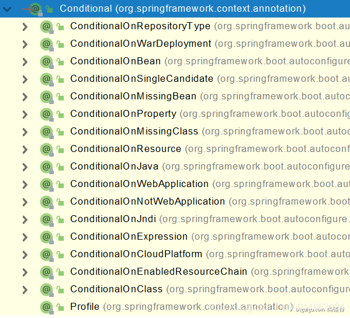

## 10、底层注解-@Conditional条件装配

**条件装配：满足Conditional指定的条件，则进行组件注入**



[官网@Conditional相关注解说明](https://docs.spring.io/spring-boot/docs/2.3.4.RELEASE/reference/html/spring-boot-features.html#boot-features-condition-annotations)


### 1、@ConditionalOnClass和@ConditionalOnMissingClass
```java
package com.atguigu.boot;

import org.junit.jupiter.api.Test;
import org.springframework.boot.autoconfigure.condition.ConditionalOnClass;
import org.springframework.boot.autoconfigure.condition.ConditionalOnMissingClass;
import org.springframework.boot.test.context.FilteredClassLoader;
import org.springframework.boot.test.context.runner.ApplicationContextRunner;
import org.springframework.context.annotation.Bean;
import org.springframework.context.annotation.Configuration;

import static org.assertj.core.api.Assertions.assertThat;

// 参考文档：https://blog.csdn.net/Developlee/article/details/100691983
public class Test1_ConditionalOnClassIntegration {

    /**
     * ApplicationContextRunner：简化自动配置测试
     * ApplicationContextRunner是一个实用程序类，它运行ApplicationContext并提供AssertJ样式断言。最好用作测试类中的字段以便共享配置，然后我们在每个测试中进行自定义：
     *
     * 知识点：
     * - AssertJ样式断言 - ApplicationContextAssert
     *  - hasBean()
     *  - doesNotHaveBean()
     * - withUserConfiguration() - ApplicationContextRunner为我们提供了withUserConfiguration方法，我们可以根据需要提供自动配置，以便为每个测试自定义ApplicationContext。
     * - run() - run 方法将 ContextConsumer 作为将断言应用于上下文的参数。测试退出时，ApplicationContext将自动关闭。
     * - FilteredClassLoader() - 当类不在classpath上时，我们如何测试相反的情况呢；这就是FilteredClassLoader发挥作用的地方。它用于在运行时过滤classpath上指定的类。
     * - withPropertyValues() - 强行更改当前context里properties文件的属性值
     */
    private final ApplicationContextRunner contextRunner = new ApplicationContextRunner();

    /**
     * 配置类：测试一些使用@ConditionalOnClass和@ConditionalOnMissingClass 注解的自动配置类
     * 这里使用静态类，也可以单独在src/main/java文件夹下创建
     */
    @Configuration
    @ConditionalOnClass(Test1_ConditionalOnClassIntegration.class)  // 当前测试类存在，则创建bean；所以这里'created' bean会被创建
    protected static class ConditionalOnClassConfiguration {
        @Bean
        public String created() {
            return "This is created when ConditionalOnClassIntegrationTest is present on the classpath";
        }
    }

    @Configuration
    @ConditionalOnMissingClass("com.atguigu.boot.Test1_ConditionalOnClassIntegration") // 当前测试类不存在，则创建bean；所以这里'missed' bean不会被创建
    protected static class ConditionalOnMissingClassConfiguration {
        @Bean
        public String missed() {
            return "This is missed when ConditionalOnClassIntegrationTest is present on the classpath";
        }
    }

    /**
     * 测试类
     */
    @Test
    public void whenDependentClassIsPresent_thenBeanCreated() {
        this.contextRunner.withUserConfiguration(ConditionalOnClassConfiguration.class)
                .run(context -> {
                    assertThat(context).hasBean("created");
                    System.out.println("=========测试context.getBean的内容为实际bean返回的字符串内容：" + context.getBean("created"));
                    assertThat(context.getBean("created")).isEqualTo("This is created when ConditionalOnClassIntegrationTest is present on the classpath");
                });
    }

    @Test
    public void whenDependentClassIsPresent_thenBeanMissing() {
        this.contextRunner.withUserConfiguration(ConditionalOnMissingClassConfiguration.class)
                .run(context -> {
                    assertThat(context).doesNotHaveBean("missed");
                });
    }

    @Test
    public void whenDependentClassIsNotPresent_thenBeanMissing() {
        this.contextRunner.withUserConfiguration(ConditionalOnClassConfiguration.class)
                .withClassLoader(new FilteredClassLoader(Test1_ConditionalOnClassIntegration.class))
                .run((context) -> {
                    assertThat(context).doesNotHaveBean("created");
                    assertThat(context).doesNotHaveBean(Test1_ConditionalOnClassIntegration.class);

                });
    }

    @Test
    public void whenDependentClassIsNotPresent_thenBeanCreated() {
        this.contextRunner.withUserConfiguration(ConditionalOnMissingClassConfiguration.class)
                // 这里过滤掉上一行类配置（ConditionalOnMissingClassConfiguration.class）要求类（Test1_ConditionalOnClassIntegration.class）不存在条件，满足条件，所以创建'missed' bean对象
                .withClassLoader(new FilteredClassLoader(Test1_ConditionalOnClassIntegration.class))
                .run((context) -> {
                    assertThat(context).hasBean("missed");
                    assertThat(context).getBean("missed")
                            .isEqualTo("This is missed when ConditionalOnClassIntegrationTest is present on the classpath");
                    assertThat(context).doesNotHaveBean(Test1_ConditionalOnClassIntegration.class);

                });
    }
}
```

### 2、@ConditionalOnBean和@ConditionalOnMissingBean
```java
package com.atguigu.boot;

import org.junit.jupiter.api.Test;
import org.springframework.boot.autoconfigure.condition.ConditionalOnBean;
import org.springframework.boot.autoconfigure.condition.ConditionalOnMissingBean;
import org.springframework.boot.test.context.runner.ApplicationContextRunner;
import org.springframework.context.annotation.Bean;
import org.springframework.context.annotation.Configuration;

import static org.assertj.core.api.Assertions.assertThat;

public class Test2_ConditionalOnBeanIntegration {

    private final ApplicationContextRunner contextRunner = new ApplicationContextRunner();

    @Configuration
    protected static class BasicConfiguration {
        @Bean
        public String created() {
            return "This is always created";
        }
    }

    @Configuration
    @ConditionalOnBean(name = "created")    // 如果名为'created' bean对象存在，则创建名为'createOnBean' bean对象
    protected static class ConditionalOnBeanConfiguration {
        @Bean
        public String createOnBean() {
            return "This is created when bean (name=created) is present";
        }
    }

    @Configuration
    @ConditionalOnMissingBean(name = "created") // 如果名为'created' bean对象不存在，则创建名为'createOnMissingBean' bean对象
    protected static class ConditionalOnMissingBeanConfiguration {
        @Bean
        public String createOnMissingBean() {
            return "This is created when bean (name=created) is missing";
        }
    }

    @Test
    public void whenDependentBeanIsPresent_thenConditionalBeanCreated() {
        this.contextRunner.withUserConfiguration(BasicConfiguration.class, ConditionalOnBeanConfiguration.class)
            .run((context) -> {
                assertThat(context).hasBean("created");
                assertThat(context).getBean("created")
                    .isEqualTo("This is always created");
                assertThat(context).hasBean("createOnBean");
                assertThat(context).getBean("createOnBean")
                    .isEqualTo("This is created when bean (name=created) is present");
            });
    }

    @Test
    public void whenDependentBeanIsPresent_thenConditionalMissingBeanIgnored() {
        this.contextRunner.withUserConfiguration(BasicConfiguration.class, ConditionalOnMissingBeanConfiguration.class)
            .run((context) -> {
                assertThat(context).hasBean("created");
                assertThat(context).getBean("created")
                    .isEqualTo("This is always created");
                assertThat(context).doesNotHaveBean("createOnMissingBean");
            });
    }

    @Test
    public void whenDependentBeanIsNotPresent_thenConditionalMissingBeanCreated() {
        this.contextRunner.withUserConfiguration(ConditionalOnMissingBeanConfiguration.class)
            .run((context) -> {
                assertThat(context).hasBean("createOnMissingBean");
                assertThat(context).getBean("createOnMissingBean")
                    .isEqualTo("This is created when bean (name=created) is missing");
                assertThat(context).doesNotHaveBean("created");
            });
    }
}
```

### 3、@ConditionalOnProperty
#### SimpleService接口
```java
public interface SimpleService {
    public String serve();
}
```
#### SimpleService实现类1 - DefaultService
```java
public class DefaultService implements SimpleService {
    @Override
    public String serve() {
        return "Default Service";
    }
}
```
#### SimpleService实现类2 - CustomService
```java
public class CustomService implements SimpleService {
    @Override
    public String serve() {
        return "Custom Service";
    }
}
```
#### 测试
```java
package com.atguigu.boot;

import com.atguigu.boot.conditionalOnProperties.CustomService;
import com.atguigu.boot.conditionalOnProperties.DefaultService;
import com.atguigu.boot.conditionalOnProperties.SimpleService;
import org.junit.jupiter.api.Test;
import org.springframework.boot.autoconfigure.condition.ConditionalOnMissingBean;
import org.springframework.boot.autoconfigure.condition.ConditionalOnProperty;
import org.springframework.boot.test.context.runner.ApplicationContextRunner;
import org.springframework.context.annotation.Bean;
import org.springframework.context.annotation.Configuration;
import org.springframework.test.context.TestPropertySource;

import static org.assertj.core.api.Assertions.assertThat;


public class Test3_1_ConditionalOnPropertyIntegration_Service {

    private final ApplicationContextRunner contextRunner = new ApplicationContextRunner();

    @Configuration
    @TestPropertySource("classpath:ConditionalOnPropertyTest.properties")   // 类路径加载相关对应测试的properties文件（可不加）
    protected static class SimpleServiceConfiguration {

        @Bean
        @ConditionalOnProperty(name = "com.baeldung.service", havingValue = "default") // 基于properties文件里的属性值为"default"来创建接口SimpleService的实现类
        @ConditionalOnMissingBean // 如果context没有，且上面条件也满足，则创建
        public DefaultService defaultService() {
            return new DefaultService();
        }

        @Bean
        @ConditionalOnProperty(name = "com.baeldung.service", havingValue = "custom") // 基于properties文件里的属性值为"custom"来创建接口SimpleService的实现类
        @ConditionalOnMissingBean // 如果context没有，且上面条件也满足，则创建
        public CustomService customService() {
            return new CustomService();
        }
    }

    @Test
    public void whenGivenCustomPropertyValue_thenCustomServiceCreated() {
        // - withPropertyValues() - 添加context里properties文件的属性值
        this.contextRunner.withPropertyValues("com.baeldung.service=custom")
            .withUserConfiguration(SimpleServiceConfiguration.class)
            .run(context -> {
                assertThat(context).hasBean("customService");
                SimpleService simpleService = context.getBean(CustomService.class);
                assertThat(simpleService.serve()).isEqualTo("Custom Service");
                assertThat(context).doesNotHaveBean("defaultService");
            });
    }

    @Test
    public void whenGivenDefaultPropertyValue_thenDefaultServiceCreated() {
        this.contextRunner.withPropertyValues("com.baeldung.service=default")
            .withUserConfiguration(SimpleServiceConfiguration.class)
            .run(context -> {
                assertThat(context).hasBean("defaultService");
                SimpleService simpleService = context.getBean(DefaultService.class);
                assertThat(simpleService.serve()).isEqualTo("Default Service");
                assertThat(context).doesNotHaveBean("customService");
            });
    }
}
```