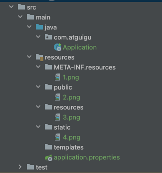
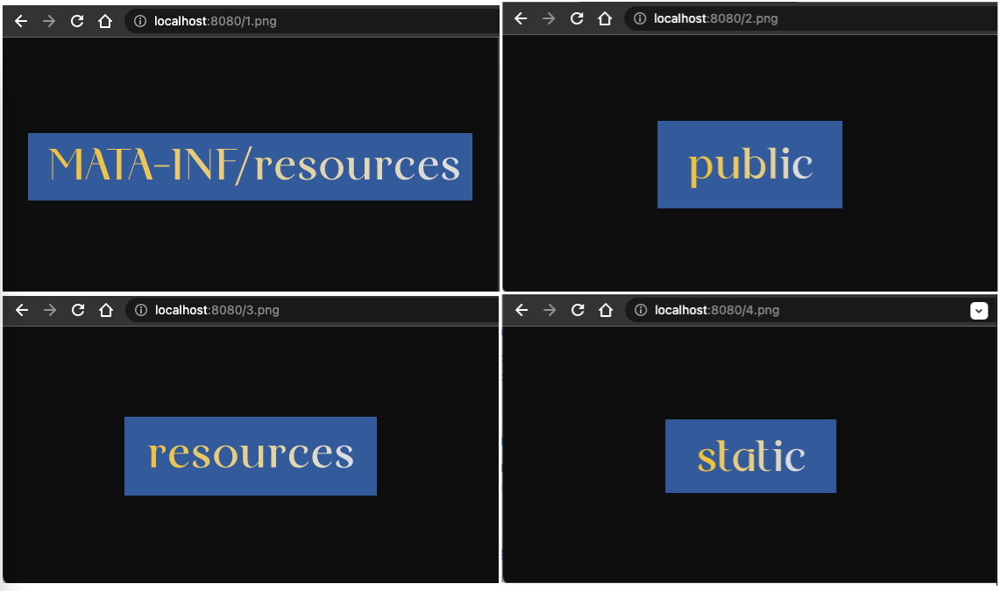
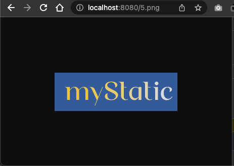
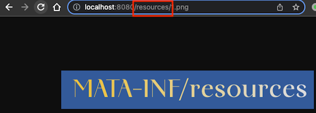
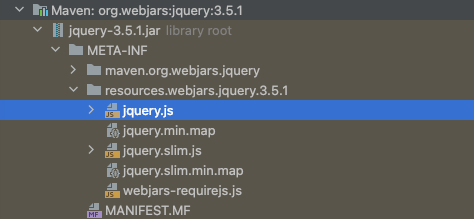
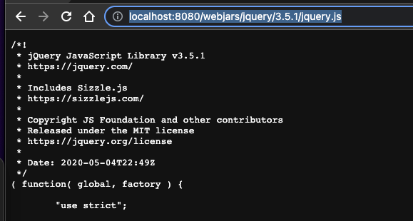

## 22、web场景-web开发简介

Spring Boot provides auto-configuration for Spring MVC that **works well with most applications.(大多场景我们都无需自定义配置)**

The auto-configuration adds the following features on top of Spring’s defaults:

- Inclusion of `ContentNegotiatingViewResolver` and `BeanNameViewResolver` beans.

    - 内容协商视图解析器和BeanName视图解析器

- Support for serving static resources, including support for WebJars (covered [later in this document](https://docs.spring.io/spring-boot/docs/current/reference/html/spring-boot-features.html#boot-features-spring-mvc-static-content))).

    - 静态资源（包括webjars）

- Automatic registration of `Converter`, `GenericConverter`, and `Formatter` beans.

    - 自动注册 `Converter，GenericConverter，Formatter `

- Support for `HttpMessageConverters` (covered [later in this document](https://docs.spring.io/spring-boot/docs/current/reference/html/spring-boot-features.html#boot-features-spring-mvc-message-converters)).

    - 支持 `HttpMessageConverters` （后来我们配合内容协商理解原理）

- Automatic registration of `MessageCodesResolver` (covered [later in this document](https://docs.spring.io/spring-boot/docs/current/reference/html/spring-boot-features.html#boot-features-spring-message-codes)).

    - 自动注册 `MessageCodesResolver` （国际化用）

- Static `index.html` support.

    - 静态index.html 页支持

- Custom `Favicon` support (covered [later in this document](https://docs.spring.io/spring-boot/docs/current/reference/html/spring-boot-features.html#boot-features-spring-mvc-favicon)).

    - 自定义 `Favicon`

- Automatic use of a `ConfigurableWebBindingInitializer` bean (covered [later in this document](https://docs.spring.io/spring-boot/docs/current/reference/html/spring-boot-features.html#boot-features-spring-mvc-web-binding-initializer)).

    - 自动使用 `ConfigurableWebBindingInitializer` ，（DataBinder负责将请求数据绑定到JavaBean上）

> If you want to keep those Spring Boot MVC customizations and make more [MVC customizations](https://docs.spring.io/spring/docs/5.2.9.RELEASE/spring-framework-reference/web.html#mvc) (interceptors, formatters, view controllers, and other features), you can add your own `@Configuration` class of type `WebMvcConfigurer` but **without** `@EnableWebMvc`.
>
> **不用@EnableWebMvc注解。使用** **`@Configuration`** **+** **`WebMvcConfigurer`** **自定义规则**

> If you want to provide custom instances of `RequestMappingHandlerMapping`, `RequestMappingHandlerAdapter`, or `ExceptionHandlerExceptionResolver`, and still keep the Spring Boot MVC customizations, you can declare a bean of type `WebMvcRegistrations` and use it to provide custom instances of those components.
>
> **声明** **`WebMvcRegistrations`** **改变默认底层组件**

> If you want to take complete control of Spring MVC, you can add your own `@Configuration` annotated with `@EnableWebMvc`, or alternatively add your own `@Configuration`-annotated `DelegatingWebMvcConfiguration` as described in the Javadoc of `@EnableWebMvc`.
>
> **使用** **`@EnableWebMvc+@Configuration+DelegatingWebMvcConfiguration 全面接管SpringMVC`**

## 23、web场景-静态资源规则与定制化

### 静态资源目录

只要静态资源放在类路径下： called `/static` (or `/public` or `/resources` or `/META-INF/resources`

访问 ： 当前项目根路径/ + 静态资源名

原理： 静态映射/**。

请求进来，先去找Controller看能不能处理。不能处理的所有请求又都交给静态资源处理器。静态资源也找不到则响应404页面。

也可以改变默认的静态资源路径，`/static`，`/public`,`/resources`, `/META-INF/resources`失效

创建图片文件并放入以上默认静态资源文件目录：


```plain/text
src/main/resources/META-INF/resources/1.png
src/main/resources/public/2.png
src/main/resources/public/3.png
src/main/resources/public/4.png
```

启动服务，根路径下访问静态资源文件：


```plain/text
http://localhost:8080/1.png // 先从controller里找是否有映射规则"1.png"，如果没有则从静态资源目录逐个找，若找到则不再往下其他目录找
http://localhost:8080/2.png
http://localhost:8080/3.png
http://localhost:8080/4.png
```

默认的静态资源访问路径，不推荐手动修改：
```properties
# 静态资源默认路径
#spring.web.resources.static-locations=classpath:/META-INF/resources/, classpath:/resources/, classpath:/static/, classpath:/public/
# 手动修改后
spring.web.resources.static-locations=classpath:/myCustomizedStaticFolder/, classpath:/META-INF/resources/, classpath:/resources/, classpath:/static/, classpath:/public/
```
手动修改默认静态资源路径后
```plain/text
// 添加自定义目录下静态资源文件
src/main/resources/myCustomizedStaticFolder/5.png
// 访问自定义目录下静态资源文件
http://localhost:8080/5.png
```


### 静态资源访问前缀
[官方文档 - SpringBoot Feature - Developing Web Applications - Static Content](https://docs.spring.io/spring-boot/docs/2.3.4.RELEASE/reference/html/spring-boot-features.html#boot-features-spring-mvc-static-content)

By default, resources are mapped on /**, but you can tune that with the spring.mvc.static-path-pattern property. For instance, relocating all resources to /resources/** can be achieved as follows:

静态资源访问前缀，默认为/**，但是当我们有拦截器时，拦截器默认一般使用"/**"作为拦截器拦截的所有请求，而排除掉静态资源特有路径请求，
为了过滤掉静态资源，这里修改静态资源访问前缀。
```properties
# 默认静态资源访问前缀
#spring.mvc.static-path-pattern=/**
# 手动修改后 - 静态资源URL访问前缀"/**"，修改成"/resources/**"，便于拦截器排除静态资源拦截
spring.mvc.static-path-pattern=/resources/**
```

启动服务，根路径下**加前缀**访问静态资源文件：
```plain/text
http://localhost:8080/resources/1.png // 先从controller里找是否有映射规则"1.png"，如果没有则从静态资源目录逐个找，若找到则不再往下其他目录找
http://localhost:8080/resources/2.png
http://localhost:8080/resources/3.png
http://localhost:8080/resources/4.png
http://localhost:8080/resources/5.png
```


当前项目 + static-path-pattern + 静态资源名 = 静态资源文件夹下找


### Webjars(补充知识)
In addition to the “standard” static resource locations mentioned earlier, a special case is made for Webjars content. Any resources with a path in /webjars/** are served from jar files if they are packaged in the Webjars format.

可用jar方式添加css，js等资源文件，

[https://www.webjars.org/](https://www.webjars.org/)

例如，添加jquery

```xml
<dependency>
    <groupId>org.webjars</groupId>
    <artifactId>jquery</artifactId>
    <version>3.5.1</version>
</dependency>
```

访问地址：[http://localhost:8080/webjars/jquery/3.5.1/jquery.js](http://localhost:8080/webjars/jquery/3.5.1/jquery.js)  后面地址要按照依赖里面的包路径。



