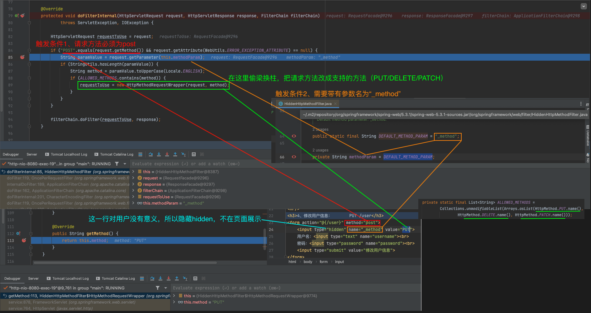

## 26、请求处理-【源码分析】-Rest映射及源码解析
[回顾视频 - https://www.bilibili.com/video/BV19K4y1L7MT/?p=26](https://www.bilibili.com/video/BV19K4y1L7MT/?p=26)
### 请求映射

- @xxxMapping;
  - @GetMapping
  - @PostMapping
  - @PutMapping
  - @DeleteMapping

- Rest风格支持（使用**HTTP**请求方式动词来表示对资源的操作）
  - 以前：
    - /getUser 获取用户
    - /deleteUser 删除用户
    - /editUser 修改用户
    - /saveUser保存用户
  - 现在： /user
    - GET-获取用户
    - DELETE-删除用户
    - PUT-修改用户
    - POST-保存用户
  - 核心Filter；HiddenHttpMethodFilter

- **用法**
  - 开启页面表单的Rest功能
  - 页面 form的属性method=post，隐藏域 \_method=put、delete等（如果直接get或post，无需隐藏域）
  - 编写请求映射

```yaml
spring:
  mvc:
    hiddenmethod:
      filter:
        enabled: true   # 开启页面表单的Rest功能(支持PUT/DELETE/PATCH方法）
```

```html
<form action="/user" method="get">
  <input value="REST-GET提交" type="submit"/>
</form>

<form action="/user" method="post">
  <input value="REST-POST提交" type="submit"/>
</form>

<form action="/user" method="post">
  <input name="_method" type="hidden" value="DELETE"/> <!-- 这行能触发HiddenHttpMethodFilter来发送DELETE请求 -->
  <input value="REST-DELETE 提交" type="submit"/>
</form>

<form action="/user" method="post">
  <input name="_method" type="hidden" value="PUT"/> <!-- 这行能触发HiddenHttpMethodFilter来发送PUT请求 -->
  <input value="REST-PUT提交" type="submit"/>
</form>
```

```java
@GetMapping("/user")
//@RequestMapping(value = "/user",method = RequestMethod.GET)
public String getUser(){
    return "GET-张三";
}

@PostMapping("/user")
//@RequestMapping(value = "/user",method = RequestMethod.POST)
public String saveUser(){
    return "POST-张三";
}

@PutMapping("/user")
//@RequestMapping(value = "/user",method = RequestMethod.PUT)
public String putUser(){
    return "PUT-张三";
}

@DeleteMapping("/user")
//@RequestMapping(value = "/user",method = RequestMethod.DELETE)
public String deleteUser(){
    return "DELETE-张三";
}
```

- Rest原理（表单提交要使用REST的时候）
  - 表单提交会带上`\_method=PUT`
  - **请求过来被**`HiddenHttpMethodFilter`拦截
    - 请求是否正常，并且是POST
      - 获取到`\_method`的值。
      - 兼容以下请求；**PUT**.**DELETE**.**PATCH**
      - **原生request（post），包装模式requesWrapper重写了getMethod方法，返回的是传入的值。**
      - **过滤器链放行的时候用wrapper。以后的方法调用getMethod是调用requesWrapper的。**

```java
public class WebMvcAutoConfiguration {
  ...  
  @Bean
  @ConditionalOnMissingBean({HiddenHttpMethodFilter.class})
  @ConditionalOnProperty(
          prefix = "spring.mvc.hiddenmethod.filter",
          name = {"enabled"},
          matchIfMissing = false    // 需要在配置文件上显式开启为true
  )
  public OrderedHiddenHttpMethodFilter hiddenHttpMethodFilter() {
    return new OrderedHiddenHttpMethodFilter();
  }
}


public class HiddenHttpMethodFilter extends OncePerRequestFilter {

	private static final List<String> ALLOWED_METHODS =
			Collections.unmodifiableList(Arrays.asList(HttpMethod.PUT.name(),
					HttpMethod.DELETE.name(), HttpMethod.PATCH.name()));

	/** Default method parameter: {@code _method}. */
	public static final String DEFAULT_METHOD_PARAM = "_method";

	private String methodParam = DEFAULT_METHOD_PARAM;


	/**
	 * Set the parameter name to look for HTTP methods.
	 * @see #DEFAULT_METHOD_PARAM
	 */
	public void setMethodParam(String methodParam) {
		Assert.hasText(methodParam, "'methodParam' must not be empty");
		this.methodParam = methodParam;
	}

	@Override
	protected void doFilterInternal(HttpServletRequest request, HttpServletResponse response, FilterChain filterChain)
			throws ServletException, IOException {

		HttpServletRequest requestToUse = request;

		if ("POST".equals(request.getMethod()) && request.getAttribute(WebUtils.ERROR_EXCEPTION_ATTRIBUTE) == null) {
			String paramValue = request.getParameter(this.methodParam);
			if (StringUtils.hasLength(paramValue)) {
				String method = paramValue.toUpperCase(Locale.ENGLISH);
				if (ALLOWED_METHODS.contains(method)) {
					requestToUse = new HttpMethodRequestWrapper(request, method);
				}
			}
		}

		filterChain.doFilter(requestToUse, response);
	}


	/**
	 * Simple {@link HttpServletRequest} wrapper that returns the supplied method for
	 * {@link HttpServletRequest#getMethod()}.
	 */
	private static class HttpMethodRequestWrapper extends HttpServletRequestWrapper {

		private final String method;

		public HttpMethodRequestWrapper(HttpServletRequest request, String method) {
			super(request);
			this.method = method;
		}

		@Override
		public String getMethod() {
			return this.method;
		}
	}

}
```
参考SpringMVC源码解析截图：



- Rest使用客户端工具。
  - 如PostMan可直接发送put、delete等方式请求。form表单则需要额外HTTP method filter来处理这类。