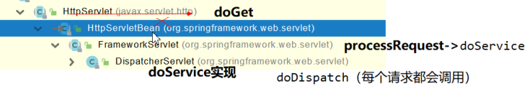

## 28、请求处理-【源码分析】-请求映射原理


[跳转查看详细执行流程与说明请参考atcn-atguigu/spring-mvc对应readme文件](https://github.com/atcn-atguigu/spring-mvc/blob/master/14_springmvc_executionFlow/README.md)

SpringMVC功能分析都从 `org.springframework.web.servlet.DispatcherServlet` -> `doDispatch()`

```java
protected void doDispatch(HttpServletRequest request, HttpServletResponse response) throws Exception {
    HttpServletRequest processedRequest = request;
    HandlerExecutionChain mappedHandler = null;
    boolean multipartRequestParsed = false;

    WebAsyncManager asyncManager = WebAsyncUtils.getAsyncManager(request);

    try {
        ModelAndView mv = null;
        Exception dispatchException = null;

        try {
            processedRequest = checkMultipart(request);
            multipartRequestParsed = (processedRequest != request);

            // 找到当前请求使用哪个Handler（Controller的方法）处理
            mappedHandler = getHandler(processedRequest);

            //HandlerMapping：处理器映射。/xxx->>xxxx
    ...
}
```

`getHandler()`方法如下：

```java
@Nullable
protected HandlerExecutionChain getHandler(HttpServletRequest request) throws Exception {
    if (this.handlerMappings != null) {
        for (HandlerMapping mapping : this.handlerMappings) {
            HandlerExecutionChain handler = mapping.getHandler(request);
            if (handler != null) {
                return handler;
            }
        }
    }
    return null;
}
```

`this.handlerMappings`在Debug模式下展现的内容：


其中，保存了所有`@RequestMapping` 和`handler`的映射规则。


所有的请求映射都在HandlerMapping中：

- *SpringBoot自动配置欢迎页的 **WelcomePageHandlerMapping** 。访问 /能访问到index.html；
- *SpringBoot自动配置了默认 的 **RequestMappingHandlerMapping**
- 请求进来，挨个尝试所有的HandlerMapping看是否有请求信息。
  - 如果有就找到这个请求对应的handler
  - 如果没有就是下一个 HandlerMapping

- 我们需要一些自定义的映射处理，我们也可以自己给容器中放**HandlerMapping**。自定义 **HandlerMapping**


---

IDEA快捷键：

- Ctrl + Alt + U : 以UML的类图展现类有哪些继承类，派生类以及实现哪些接口。

- Ctrl + Alt + Shift + U : 同上，区别在于上条快捷键结果在新页展现，而本条快捷键结果在弹窗展现。

- Ctrl + H : 以树形方式展现类层次结构图。
