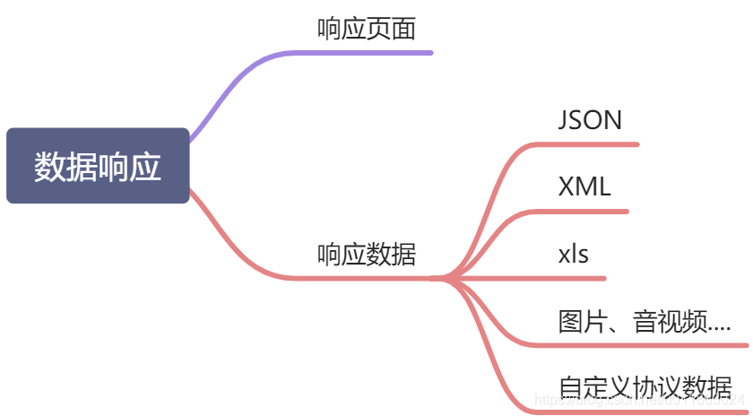

# Todo: 后续有时间再整理案例代码
https://www.bilibili.com/video/BV19K4y1L7MT/?p=32 ~ https://www.bilibili.com/video/BV19K4y1L7MT/?p=42
## 32、请求处理-【源码分析】-各种类型参数解析原理
这要从`DispatcherServlet`开始说起：

```java
public class DispatcherServlet extends FrameworkServlet {

    protected void doDispatch(HttpServletRequest request, HttpServletResponse response) throws Exception {
        HttpServletRequest processedRequest = request;
        HandlerExecutionChain mappedHandler = null;
        boolean multipartRequestParsed = false;

        WebAsyncManager asyncManager = WebAsyncUtils.getAsyncManager(request);

        try {
            ModelAndView mv = null;
            Exception dispatchException = null;

            try {
                processedRequest = checkMultipart(request);
                multipartRequestParsed = (processedRequest != request);

                // Determine handler for the current request.
                mappedHandler = getHandler(processedRequest);
                if (mappedHandler == null) {
                    noHandlerFound(processedRequest, response);
                    return;
                }

                // Determine handler adapter for the current request.
                HandlerAdapter ha = getHandlerAdapter(mappedHandler.getHandler());
                ...
```

- `HandlerMapping`中找到能处理请求的`Handler`（Controller.method()）。
- 为当前Handler 找一个适配器 `HandlerAdapter`，用的最多的是**RequestMappingHandlerAdapter**。
- 适配器执行目标方法并确定方法参数的每一个值。

### HandlerAdapter

默认会加载所有`HandlerAdapter`

```java
public class DispatcherServlet extends FrameworkServlet {

    /** Detect all HandlerAdapters or just expect "handlerAdapter" bean?. */
    private boolean detectAllHandlerAdapters = true;

    ...

    private void initHandlerAdapters(ApplicationContext context) {
        this.handlerAdapters = null;

        if (this.detectAllHandlerAdapters) {
            // Find all HandlerAdapters in the ApplicationContext, including ancestor contexts.
            Map<String, HandlerAdapter> matchingBeans =
                    BeanFactoryUtils.beansOfTypeIncludingAncestors(context, HandlerAdapter.class, true, false);
            if (!matchingBeans.isEmpty()) {
                this.handlerAdapters = new ArrayList<>(matchingBeans.values());
                // We keep HandlerAdapters in sorted order.
                AnnotationAwareOrderComparator.sort(this.handlerAdapters);
            }
        }
     ...
```

有这些`HandlerAdapter`：


0. 支持方法上标注`@RequestMapping`

1. 支持函数式编程的
2. ...
3. ...

### 执行目标方法

```java
public class DispatcherServlet extends FrameworkServlet {

    protected void doDispatch(HttpServletRequest request, HttpServletResponse response) throws Exception {
        ModelAndView mv = null;
        
        ...

        // Determine handler for the current request.
        mappedHandler = getHandler(processedRequest);
        if (mappedHandler == null) {
            noHandlerFound(processedRequest, response);
            return;
        }

        // Determine handler adapter for the current request.
        HandlerAdapter ha = getHandlerAdapter(mappedHandler.getHandler());

        ...
        //本节重点
        // Actually invoke the handler.
        mv = ha.handle(processedRequest, response, mappedHandler.getHandler());
```

`HandlerAdapter`接口实现类`RequestMappingHandlerAdapter`（主要用来处理`@RequestMapping`）

```java
public class RequestMappingHandlerAdapter extends AbstractHandlerMethodAdapter
        implements BeanFactoryAware, InitializingBean {

    ...

    //AbstractHandlerMethodAdapter类的方法，RequestMappingHandlerAdapter继承AbstractHandlerMethodAdapter
    public final ModelAndView handle(HttpServletRequest request, HttpServletResponse response, Object handler)
            throws Exception {

        return handleInternal(request, response, (HandlerMethod) handler);
    }

    @Override
    protected ModelAndView handleInternal(HttpServletRequest request,
                                          HttpServletResponse response, HandlerMethod handlerMethod) throws Exception {
        ModelAndView mav;
        //handleInternal的核心
        mav = invokeHandlerMethod(request, response, handlerMethod);//解释看下节
        //...
        return mav;
    }
}
```

### 参数解析器

确定将要执行的目标方法的每一个参数的值是什么;

SpringMVC目标方法能写多少种参数类型。取决于**参数解析器argumentResolvers**。

```java
@Nullable
protected ModelAndView invokeHandlerMethod(HttpServletRequest request,
        HttpServletResponse response,HandlerMethod handlerMethod)throws Exception{

        ServletWebRequest webRequest=new ServletWebRequest(request,response);
        try{
        WebDataBinderFactory binderFactory=getDataBinderFactory(handlerMethod);
        ModelFactory modelFactory=getModelFactory(handlerMethod,binderFactory);

        ServletInvocableHandlerMethod invocableMethod=createInvocableHandlerMethod(handlerMethod);
        if(this.argumentResolvers!=null){//<-----关注点
        invocableMethod.setHandlerMethodArgumentResolvers(this.argumentResolvers);
        }

        ...
```

`this.argumentResolvers`在`afterPropertiesSet()`方法内初始化

```java
public class RequestMappingHandlerAdapter extends AbstractHandlerMethodAdapter
        implements BeanFactoryAware, InitializingBean {

    @Nullable
    private HandlerMethodArgumentResolverComposite argumentResolvers;

    @Override
    public void afterPropertiesSet() {
        ...
        if (this.argumentResolvers == null) {//初始化argumentResolvers
            List<HandlerMethodArgumentResolver> resolvers = getDefaultArgumentResolvers();
            this.argumentResolvers = new HandlerMethodArgumentResolverComposite().addResolvers(resolvers);
        }
        ...
    }

    //初始化了一堆的实现HandlerMethodArgumentResolver接口的
    private List<HandlerMethodArgumentResolver> getDefaultArgumentResolvers() {
        List<HandlerMethodArgumentResolver> resolvers = new ArrayList<>(30);

        // Annotation-based argument resolution
        resolvers.add(new RequestParamMethodArgumentResolver(getBeanFactory(), false));
        resolvers.add(new RequestParamMapMethodArgumentResolver());
        resolvers.add(new PathVariableMethodArgumentResolver());
        resolvers.add(new PathVariableMapMethodArgumentResolver());
        resolvers.add(new MatrixVariableMethodArgumentResolver());
        resolvers.add(new MatrixVariableMapMethodArgumentResolver());
        resolvers.add(new ServletModelAttributeMethodProcessor(false));
        resolvers.add(new RequestResponseBodyMethodProcessor(getMessageConverters(), this.requestResponseBodyAdvice));
        resolvers.add(new RequestPartMethodArgumentResolver(getMessageConverters(), this.requestResponseBodyAdvice));
        resolvers.add(new RequestHeaderMethodArgumentResolver(getBeanFactory()));
        resolvers.add(new RequestHeaderMapMethodArgumentResolver());
        resolvers.add(new ServletCookieValueMethodArgumentResolver(getBeanFactory()));
        resolvers.add(new ExpressionValueMethodArgumentResolver(getBeanFactory()));
        resolvers.add(new SessionAttributeMethodArgumentResolver());
        resolvers.add(new RequestAttributeMethodArgumentResolver());

        // Type-based argument resolution
        resolvers.add(new ServletRequestMethodArgumentResolver());
        resolvers.add(new ServletResponseMethodArgumentResolver());
        resolvers.add(new HttpEntityMethodProcessor(getMessageConverters(), this.requestResponseBodyAdvice));
        resolvers.add(new RedirectAttributesMethodArgumentResolver());
        resolvers.add(new ModelMethodProcessor());
        resolvers.add(new MapMethodProcessor());
        resolvers.add(new ErrorsMethodArgumentResolver());
        resolvers.add(new SessionStatusMethodArgumentResolver());
        resolvers.add(new UriComponentsBuilderMethodArgumentResolver());
        if (KotlinDetector.isKotlinPresent()) {
            resolvers.add(new ContinuationHandlerMethodArgumentResolver());
        }

        // Custom arguments
        if (getCustomArgumentResolvers() != null) {
            resolvers.addAll(getCustomArgumentResolvers());
        }

        // Catch-all
        resolvers.add(new PrincipalMethodArgumentResolver());
        resolvers.add(new RequestParamMethodArgumentResolver(getBeanFactory(), true));
        resolvers.add(new ServletModelAttributeMethodProcessor(true));

        return resolvers;
    }

}
```

`HandlerMethodArgumentResolverComposite`类如下：（众多**参数解析器argumentResolvers**的包装类）。

```java
public class HandlerMethodArgumentResolverComposite implements HandlerMethodArgumentResolver {

    private final List<HandlerMethodArgumentResolver> argumentResolvers = new ArrayList<>();
    
    ...

    public HandlerMethodArgumentResolverComposite addResolvers(
            @Nullable HandlerMethodArgumentResolver... resolvers) {

        if (resolvers != null) {
            Collections.addAll(this.argumentResolvers, resolvers);
        }
        return this;
    }
    
    ...
}
```

我们看看`HandlerMethodArgumentResolver`的源码：

```java
public interface HandlerMethodArgumentResolver {

    //当前解析器是否支持解析这种参数
    boolean supportsParameter(MethodParameter parameter);

    @Nullable
//如果支持，就调用 resolveArgument
    Object resolveArgument(MethodParameter parameter, @Nullable ModelAndViewContainer mavContainer,
                           NativeWebRequest webRequest, @Nullable WebDataBinderFactory binderFactory) throws Exception;

}

```

### 返回值处理器

**ValueHandler**

```java
@Nullable
protected ModelAndView invokeHandlerMethod(HttpServletRequest request,
        HttpServletResponse response,HandlerMethod handlerMethod)throws Exception{

        ServletWebRequest webRequest=new ServletWebRequest(request,response);
        try{
        WebDataBinderFactory binderFactory=getDataBinderFactory(handlerMethod);
        ModelFactory modelFactory=getModelFactory(handlerMethod,binderFactory);

        ServletInvocableHandlerMethod invocableMethod=createInvocableHandlerMethod(handlerMethod);
        if(this.argumentResolvers!=null){
        invocableMethod.setHandlerMethodArgumentResolvers(this.argumentResolvers);
        }
        if(this.returnValueHandlers!=null){//<---关注点
        invocableMethod.setHandlerMethodReturnValueHandlers(this.returnValueHandlers);
        }
        ...

```

`this.returnValueHandlers`在`afterPropertiesSet()`方法内初始化

```java
public class RequestMappingHandlerAdapter extends AbstractHandlerMethodAdapter
        implements BeanFactoryAware, InitializingBean {

    @Nullable
    private HandlerMethodReturnValueHandlerComposite returnValueHandlers;

    @Override
    public void afterPropertiesSet() {

        ...

        if (this.returnValueHandlers == null) {
            List<HandlerMethodReturnValueHandler> handlers = getDefaultReturnValueHandlers();
            this.returnValueHandlers = new HandlerMethodReturnValueHandlerComposite().addHandlers(handlers);
        }
    }

    //初始化了一堆的实现HandlerMethodReturnValueHandler接口的
    private List<HandlerMethodReturnValueHandler> getDefaultReturnValueHandlers() {
        List<HandlerMethodReturnValueHandler> handlers = new ArrayList<>(20);

        // Single-purpose return value types
        handlers.add(new ModelAndViewMethodReturnValueHandler());
        handlers.add(new ModelMethodProcessor());
        handlers.add(new ViewMethodReturnValueHandler());
        handlers.add(new ResponseBodyEmitterReturnValueHandler(getMessageConverters(),
                this.reactiveAdapterRegistry, this.taskExecutor, this.contentNegotiationManager));
        handlers.add(new StreamingResponseBodyReturnValueHandler());
        handlers.add(new HttpEntityMethodProcessor(getMessageConverters(),
                this.contentNegotiationManager, this.requestResponseBodyAdvice));
        handlers.add(new HttpHeadersReturnValueHandler());
        handlers.add(new CallableMethodReturnValueHandler());
        handlers.add(new DeferredResultMethodReturnValueHandler());
        handlers.add(new AsyncTaskMethodReturnValueHandler(this.beanFactory));

        // Annotation-based return value types
        handlers.add(new ServletModelAttributeMethodProcessor(false));
        handlers.add(new RequestResponseBodyMethodProcessor(getMessageConverters(),
                this.contentNegotiationManager, this.requestResponseBodyAdvice));

        // Multi-purpose return value types
        handlers.add(new ViewNameMethodReturnValueHandler());
        handlers.add(new MapMethodProcessor());

        // Custom return value types
        if (getCustomReturnValueHandlers() != null) {
            handlers.addAll(getCustomReturnValueHandlers());
        }

        // Catch-all
        if (!CollectionUtils.isEmpty(getModelAndViewResolvers())) {
            handlers.add(new ModelAndViewResolverMethodReturnValueHandler(getModelAndViewResolvers()));
        } else {
            handlers.add(new ServletModelAttributeMethodProcessor(true));
        }

        return handlers;
    }
}
```

`HandlerMethodReturnValueHandlerComposite`类如下：

```java
public class HandlerMethodReturnValueHandlerComposite implements HandlerMethodReturnValueHandler {

    private final List<HandlerMethodReturnValueHandler> returnValueHandlers = new ArrayList<>();

    ...

    public HandlerMethodReturnValueHandlerComposite addHandlers(
            @Nullable List<? extends HandlerMethodReturnValueHandler> handlers) {

        if (handlers != null) {
            this.returnValueHandlers.addAll(handlers);
        }
        return this;
    }

}
```

`HandlerMethodReturnValueHandler`接口：

```java
public interface HandlerMethodReturnValueHandler {

    boolean supportsReturnType(MethodParameter returnType);

    void handleReturnValue(@Nullable Object returnValue, MethodParameter returnType,
                           ModelAndViewContainer mavContainer, NativeWebRequest webRequest) throws Exception;

}
```

### 回顾执行目标方法

```java
public class DispatcherServlet extends FrameworkServlet {
    ...

    protected void doDispatch(HttpServletRequest request, HttpServletResponse response) throws Exception {
        ModelAndView mv = null;
		...
        mv = ha.handle(processedRequest, response, mappedHandler.getHandler());
```

`RequestMappingHandlerAdapter`的`handle()`方法：

```java
public class RequestMappingHandlerAdapter extends AbstractHandlerMethodAdapter
        implements BeanFactoryAware, InitializingBean {

    ...

    //AbstractHandlerMethodAdapter类的方法，RequestMappingHandlerAdapter继承AbstractHandlerMethodAdapter
    public final ModelAndView handle(HttpServletRequest request, HttpServletResponse response, Object handler)
            throws Exception {

        return handleInternal(request, response, (HandlerMethod) handler);
    }

    @Override
    protected ModelAndView handleInternal(HttpServletRequest request,
                                          HttpServletResponse response, HandlerMethod handlerMethod) throws Exception {
        ModelAndView mav;
        //handleInternal的核心
        mav = invokeHandlerMethod(request, response, handlerMethod);//解释看下节
        //...
        return mav;
    }
}
```

`RequestMappingHandlerAdapter`的`invokeHandlerMethod()`方法：

```java
public class RequestMappingHandlerAdapter extends AbstractHandlerMethodAdapter
        implements BeanFactoryAware, InitializingBean {

    protected ModelAndView invokeHandlerMethod(HttpServletRequest request,
                                               HttpServletResponse response, HandlerMethod handlerMethod) throws Exception {

        ServletWebRequest webRequest = new ServletWebRequest(request, response);
        try {
			...

            ServletInvocableHandlerMethod invocableMethod = createInvocableHandlerMethod(handlerMethod);
            if (this.argumentResolvers != null) {
                invocableMethod.setHandlerMethodArgumentResolvers(this.argumentResolvers);
            }
            if (this.returnValueHandlers != null) {
                invocableMethod.setHandlerMethodReturnValueHandlers(this.returnValueHandlers);
            }
			...

            //关注点：执行目标方法
            invocableMethod.invokeAndHandle(webRequest, mavContainer);
            if (asyncManager.isConcurrentHandlingStarted()) {
                return null;
            }

            return getModelAndView(mavContainer, modelFactory, webRequest);
        } finally {
            webRequest.requestCompleted();
        }
    }
```

`invokeAndHandle()`方法如下：

```java
public class ServletInvocableHandlerMethod extends InvocableHandlerMethod {

    public void invokeAndHandle(ServletWebRequest webRequest, ModelAndViewContainer mavContainer,
                                Object... providedArgs) throws Exception {

        Object returnValue = invokeForRequest(webRequest, mavContainer, providedArgs);

        ...

        try {
            //returnValue存储起来
            this.returnValueHandlers.handleReturnValue(
                    returnValue, getReturnValueType(returnValue), mavContainer, webRequest);
        } catch (Exception ex) {
			...
        }
    }

    @Nullable//InvocableHandlerMethod类的，ServletInvocableHandlerMethod类继承InvocableHandlerMethod类
    public Object invokeForRequest(NativeWebRequest request, @Nullable ModelAndViewContainer mavContainer,
                                   Object... providedArgs) throws Exception {

        ////获取方法的参数值
        Object[] args = getMethodArgumentValues(request, mavContainer, providedArgs);

        ...

        return doInvoke(args);
    }

    @Nullable
    protected Object doInvoke(Object... args) throws Exception {
        Method method = getBridgedMethod();//@RequestMapping的方法
        ReflectionUtils.makeAccessible(method);
        try {
            if (KotlinDetector.isSuspendingFunction(method)) {
                return CoroutinesUtils.invokeSuspendingFunction(method, getBean(), args);
            }
            //通过反射调用
            return method.invoke(getBean(), args);//getBean()指@RequestMapping的方法所在类的对象。
        } catch (IllegalArgumentException ex) {
			...
        } catch (InvocationTargetException ex) {
			...
        }
    }

}   
```

### 如何确定目标方法每一个参数的值

重点分析`ServletInvocableHandlerMethod`的`getMethodArgumentValues`方法

```java
public class ServletInvocableHandlerMethod extends InvocableHandlerMethod {
    ...

    @Nullable//InvocableHandlerMethod类的，ServletInvocableHandlerMethod类继承InvocableHandlerMethod类
    public Object invokeForRequest(NativeWebRequest request, @Nullable ModelAndViewContainer mavContainer,
                                   Object... providedArgs) throws Exception {

        ////获取方法的参数值
        Object[] args = getMethodArgumentValues(request, mavContainer, providedArgs);

        ...

        return doInvoke(args);
    }

    //本节重点，获取方法的参数值
    protected Object[] getMethodArgumentValues(NativeWebRequest request, @Nullable ModelAndViewContainer mavContainer,
                                               Object... providedArgs) throws Exception {

        MethodParameter[] parameters = getMethodParameters();
        if (ObjectUtils.isEmpty(parameters)) {
            return EMPTY_ARGS;
        }

        Object[] args = new Object[parameters.length];
        for (int i = 0; i < parameters.length; i++) {
            MethodParameter parameter = parameters[i];
            parameter.initParameterNameDiscovery(this.parameterNameDiscoverer);
            args[i] = findProvidedArgument(parameter, providedArgs);
            if (args[i] != null) {
                continue;
            }
            //查看resolvers是否有支持
            if (!this.resolvers.supportsParameter(parameter)) {
                throw new IllegalStateException(formatArgumentError(parameter, "No suitable resolver"));
            }
            try {
                //支持的话就开始解析吧
                args[i] = this.resolvers.resolveArgument(parameter, mavContainer, request, this.dataBinderFactory);
            } catch (Exception ex) {
				....
            }
        }
        return args;
    }

}
```

`this.resolvers`的类型为`HandlerMethodArgumentResolverComposite`（在[参数解析器](#)章节提及）

```java
public class HandlerMethodArgumentResolverComposite implements HandlerMethodArgumentResolver {

    @Override
    public boolean supportsParameter(MethodParameter parameter) {
        return getArgumentResolver(parameter) != null;
    }

    @Override
    @Nullable
    public Object resolveArgument(MethodParameter parameter, @Nullable ModelAndViewContainer mavContainer,
                                  NativeWebRequest webRequest, @Nullable WebDataBinderFactory binderFactory) throws Exception {

        HandlerMethodArgumentResolver resolver = getArgumentResolver(parameter);
        if (resolver == null) {
            throw new IllegalArgumentException("Unsupported parameter type [" +
                    parameter.getParameterType().getName() + "]. supportsParameter should be called first.");
        }
        return resolver.resolveArgument(parameter, mavContainer, webRequest, binderFactory);
    }


    @Nullable
    private HandlerMethodArgumentResolver getArgumentResolver(MethodParameter parameter) {
        HandlerMethodArgumentResolver result = this.argumentResolverCache.get(parameter);
        if (result == null) {
            //挨个判断所有参数解析器那个支持解析这个参数
            for (HandlerMethodArgumentResolver resolver : this.argumentResolvers) {
                if (resolver.supportsParameter(parameter)) {
                    result = resolver;
                    this.argumentResolverCache.put(parameter, result);//找到了，resolver就缓存起来，方便稍后resolveArgument()方法使用
                    break;
                }
            }
        }
        return result;
    }
}
```

### 小结

本节描述，一个请求发送到DispatcherServlet后的具体处理流程，也就是SpringMVC的主要原理。

本节内容较多且硬核，对日后编程很有帮助，需耐心对待。

可以运行一个示例，打断点，在Debug模式下，查看程序流程。

## 33、请求处理-【源码分析】-Servlet API参数解析原理

- WebRequest
- ServletRequest
- MultipartRequest
- HttpSession
- javax.servlet.http.PushBuilder
- Principal
- InputStream
- Reader
- HttpMethod
- Locale
- TimeZone
- ZoneId

**ServletRequestMethodArgumentResolver**用来处理以上的参数

```java
public class ServletRequestMethodArgumentResolver implements HandlerMethodArgumentResolver {

    @Nullable
    private static Class<?> pushBuilder;

    static {
        try {
            pushBuilder = ClassUtils.forName("javax.servlet.http.PushBuilder",
                    ServletRequestMethodArgumentResolver.class.getClassLoader());
        } catch (ClassNotFoundException ex) {
            // Servlet 4.0 PushBuilder not found - not supported for injection
            pushBuilder = null;
        }
    }


    @Override
    public boolean supportsParameter(MethodParameter parameter) {
        Class<?> paramType = parameter.getParameterType();
        return (WebRequest.class.isAssignableFrom(paramType) ||
                ServletRequest.class.isAssignableFrom(paramType) ||
                MultipartRequest.class.isAssignableFrom(paramType) ||
                HttpSession.class.isAssignableFrom(paramType) ||
                (pushBuilder != null && pushBuilder.isAssignableFrom(paramType)) ||
                (Principal.class.isAssignableFrom(paramType) && !parameter.hasParameterAnnotations()) ||
                InputStream.class.isAssignableFrom(paramType) ||
                Reader.class.isAssignableFrom(paramType) ||
                HttpMethod.class == paramType ||
                Locale.class == paramType ||
                TimeZone.class == paramType ||
                ZoneId.class == paramType);
    }

    @Override
    public Object resolveArgument(MethodParameter parameter, @Nullable ModelAndViewContainer mavContainer,
                                  NativeWebRequest webRequest, @Nullable WebDataBinderFactory binderFactory) throws Exception {

        Class<?> paramType = parameter.getParameterType();

        // WebRequest / NativeWebRequest / ServletWebRequest
        if (WebRequest.class.isAssignableFrom(paramType)) {
            if (!paramType.isInstance(webRequest)) {
                throw new IllegalStateException(
                        "Current request is not of type [" + paramType.getName() + "]: " + webRequest);
            }
            return webRequest;
        }

        // ServletRequest / HttpServletRequest / MultipartRequest / MultipartHttpServletRequest
        if (ServletRequest.class.isAssignableFrom(paramType) || MultipartRequest.class.isAssignableFrom(paramType)) {
            return resolveNativeRequest(webRequest, paramType);
        }

        // HttpServletRequest required for all further argument types
        return resolveArgument(paramType, resolveNativeRequest(webRequest, HttpServletRequest.class));
    }

    private <T> T resolveNativeRequest(NativeWebRequest webRequest, Class<T> requiredType) {
        T nativeRequest = webRequest.getNativeRequest(requiredType);
        if (nativeRequest == null) {
            throw new IllegalStateException(
                    "Current request is not of type [" + requiredType.getName() + "]: " + webRequest);
        }
        return nativeRequest;
    }

    @Nullable
    private Object resolveArgument(Class<?> paramType, HttpServletRequest request) throws IOException {
        if (HttpSession.class.isAssignableFrom(paramType)) {
            HttpSession session = request.getSession();
            if (session != null && !paramType.isInstance(session)) {
                throw new IllegalStateException(
                        "Current session is not of type [" + paramType.getName() + "]: " + session);
            }
            return session;
        } else if (pushBuilder != null && pushBuilder.isAssignableFrom(paramType)) {
            return PushBuilderDelegate.resolvePushBuilder(request, paramType);
        } else if (InputStream.class.isAssignableFrom(paramType)) {
            InputStream inputStream = request.getInputStream();
            if (inputStream != null && !paramType.isInstance(inputStream)) {
                throw new IllegalStateException(
                        "Request input stream is not of type [" + paramType.getName() + "]: " + inputStream);
            }
            return inputStream;
        } else if (Reader.class.isAssignableFrom(paramType)) {
            Reader reader = request.getReader();
            if (reader != null && !paramType.isInstance(reader)) {
                throw new IllegalStateException(
                        "Request body reader is not of type [" + paramType.getName() + "]: " + reader);
            }
            return reader;
        } else if (Principal.class.isAssignableFrom(paramType)) {
            Principal userPrincipal = request.getUserPrincipal();
            if (userPrincipal != null && !paramType.isInstance(userPrincipal)) {
                throw new IllegalStateException(
                        "Current user principal is not of type [" + paramType.getName() + "]: " + userPrincipal);
            }
            return userPrincipal;
        } else if (HttpMethod.class == paramType) {
            return HttpMethod.resolve(request.getMethod());
        } else if (Locale.class == paramType) {
            return RequestContextUtils.getLocale(request);
        } else if (TimeZone.class == paramType) {
            TimeZone timeZone = RequestContextUtils.getTimeZone(request);
            return (timeZone != null ? timeZone : TimeZone.getDefault());
        } else if (ZoneId.class == paramType) {
            TimeZone timeZone = RequestContextUtils.getTimeZone(request);
            return (timeZone != null ? timeZone.toZoneId() : ZoneId.systemDefault());
        }

        // Should never happen...
        throw new UnsupportedOperationException("Unknown parameter type: " + paramType.getName());
    }


    /**
     * Inner class to avoid a hard dependency on Servlet API 4.0 at runtime.
     */
    private static class PushBuilderDelegate {

        @Nullable
        public static Object resolvePushBuilder(HttpServletRequest request, Class<?> paramType) {
            PushBuilder pushBuilder = request.newPushBuilder();
            if (pushBuilder != null && !paramType.isInstance(pushBuilder)) {
                throw new IllegalStateException(
                        "Current push builder is not of type [" + paramType.getName() + "]: " + pushBuilder);
            }
            return pushBuilder;

        }
    }
}
```

用例：

```java

@Controller
public class RequestController {

    @GetMapping("/goto")
    public String goToPage(HttpServletRequest request) {

        request.setAttribute("msg", "成功了...");
        request.setAttribute("code", 200);
        return "forward:/success";  //转发到  /success请求
    }
}
```

## 34、请求处理-【源码分析】-Model、Map原理

复杂参数：

- **Map**
- **Model（map、model里面的数据会被放在request的请求域 request.setAttribute）**
- Errors/BindingResult
- **RedirectAttributes（ 重定向携带数据）**
- **ServletResponse（response）**
- SessionStatus

- UriComponentsBuilder
- ServletUriComponentsBuilder

用例：

```java
@GetMapping("/params")
public String testParam(Map<String, Object> map,
        Model model,
        HttpServletRequest request,
        HttpServletResponse response){
        //下面三位都是可以给request域中放数据
        map.put("hello","world666");
        model.addAttribute("world","hello666");
        request.setAttribute("message","HelloWorld");

        Cookie cookie=new Cookie("c1","v1");
        response.addCookie(cookie);
        return"forward:/success";
        }

@ResponseBody
@GetMapping("/success")
public Map success(@RequestAttribute(value = "msg", required = false) String msg,
@RequestAttribute(value = "code", required = false)Integer code,
        HttpServletRequest request){
        Object msg1=request.getAttribute("msg");

        Map<String, Object> map=new HashMap<>();
        Object hello=request.getAttribute("hello");//得出testParam方法赋予的值 world666
        Object world=request.getAttribute("world");//得出testParam方法赋予的值 hello666
        Object message=request.getAttribute("message");//得出testParam方法赋予的值 HelloWorld

        map.put("reqMethod_msg",msg1);
        map.put("annotation_msg",msg);
        map.put("hello",hello);
        map.put("world",world);
        map.put("message",message);

        return map;
        }
```

- `Map<String,Object> map`

- `Model model`

- `HttpServletRequest request`

上面三位都是可以给request域中放数据，用`request.getAttribute()`获取

接下来我们看看，`Map<String,Object> map`与`Model model`用什么参数处理器。

---

`Map<String,Object> map`参数用`MapMethodProcessor`处理：

```java
public class MapMethodProcessor implements HandlerMethodArgumentResolver, HandlerMethodReturnValueHandler {

    @Override
    public boolean supportsParameter(MethodParameter parameter) {
        return (Map.class.isAssignableFrom(parameter.getParameterType()) &&
                parameter.getParameterAnnotations().length == 0);
    }

    @Override
    @Nullable
    public Object resolveArgument(MethodParameter parameter, @Nullable ModelAndViewContainer mavContainer,
                                  NativeWebRequest webRequest, @Nullable WebDataBinderFactory binderFactory) throws Exception {

        Assert.state(mavContainer != null, "ModelAndViewContainer is required for model exposure");
        return mavContainer.getModel();
    }
    
    ...

}
```

`mavContainer.getModel()`如下：

```java
public class ModelAndViewContainer {

    ...

    private final ModelMap defaultModel = new BindingAwareModelMap();

    @Nullable
    private ModelMap redirectModel;

    ...

    public ModelMap getModel() {
        if (useDefaultModel()) {
            return this.defaultModel;
        } else {
            if (this.redirectModel == null) {
                this.redirectModel = new ModelMap();
            }
            return this.redirectModel;
        }
    }

    private boolean useDefaultModel() {
        return (!this.redirectModelScenario || (this.redirectModel == null && !this.ignoreDefaultModelOnRedirect));
    }
    ...

}
```

---

`Model model`用`ModelMethodProcessor`处理：

```java
public class ModelMethodProcessor implements HandlerMethodArgumentResolver, HandlerMethodReturnValueHandler {

    @Override
    public boolean supportsParameter(MethodParameter parameter) {
        return Model.class.isAssignableFrom(parameter.getParameterType());
    }

    @Override
    @Nullable
    public Object resolveArgument(MethodParameter parameter, @Nullable ModelAndViewContainer mavContainer,
                                  NativeWebRequest webRequest, @Nullable WebDataBinderFactory binderFactory) throws Exception {

        Assert.state(mavContainer != null, "ModelAndViewContainer is required for model exposure");
        return mavContainer.getModel();
    }
    ...
}
```

`return mavContainer.getModel();`这跟`MapMethodProcessor`的一致


`Model`也是另一种意义的`Map`。

---

**接下来看看**`Map<String,Object> map`与`Model model`值是如何做到用`request.getAttribute()`获取的。

众所周知，所有的数据都放在 **ModelAndView**包含要去的页面地址View，还包含Model数据。

先看**ModelAndView**接下来是如何处理的？

```java
public class DispatcherServlet extends FrameworkServlet {
    
    ...

    protected void doDispatch(HttpServletRequest request, HttpServletResponse response) throws Exception {
		...

        try {
            ModelAndView mv = null;
            
            ...

            // Actually invoke the handler.
            mv = ha.handle(processedRequest, response, mappedHandler.getHandler());
            
            ...

        } catch (Exception ex) {
            dispatchException = ex;
        } catch (Throwable err) {
            // As of 4.3, we're processing Errors thrown from handler methods as well,
            // making them available for @ExceptionHandler methods and other scenarios.
            dispatchException = new NestedServletException("Handler dispatch failed", err);
        }
        //处理分发结果
        processDispatchResult(processedRequest, response, mappedHandler, mv, dispatchException);
    }
        ...

}

    private void processDispatchResult(HttpServletRequest request, HttpServletResponse response,
                                       @Nullable HandlerExecutionChain mappedHandler, @Nullable ModelAndView mv,
                                       @Nullable Exception exception) throws Exception {
        ...

        // Did the handler return a view to render?
        if (mv != null && !mv.wasCleared()) {
            render(mv, request, response);
			...
        }
		...
    }

    protected void render(ModelAndView mv, HttpServletRequest request, HttpServletResponse response) throws Exception {
		...

        View view;
        String viewName = mv.getViewName();
        if (viewName != null) {
            // We need to resolve the view name.
            view = resolveViewName(viewName, mv.getModelInternal(), locale, request);
            if (view == null) {
                throw new ServletException("Could not resolve view with name '" + mv.getViewName() +
                        "' in servlet with name '" + getServletName() + "'");
            }
        } else {
            // No need to lookup: the ModelAndView object contains the actual View object.
            view = mv.getView();
            if (view == null) {
                throw new ServletException("ModelAndView [" + mv + "] neither contains a view name nor a " +
                        "View object in servlet with name '" + getServletName() + "'");
            }
        }
        view.render(mv.getModelInternal(), request, response);
        
        ...
    }

}
```

在Debug模式下，`view`属为`InternalResourceView`类。

```java
public class InternalResourceView extends AbstractUrlBasedView {

    @Override//该方法在AbstractView，AbstractUrlBasedView继承了AbstractView
    public void render(@Nullable Map<String, ?> model, HttpServletRequest request,
                       HttpServletResponse response) throws Exception {
		
        ...

        Map<String, Object> mergedModel = createMergedOutputModel(model, request, response);
        prepareResponse(request, response);

        //看下一个方法实现
        renderMergedOutputModel(mergedModel, getRequestToExpose(request), response);
    }

    @Override
    protected void renderMergedOutputModel(
            Map<String, Object> model, HttpServletRequest request, HttpServletResponse response) throws Exception {

        // Expose the model object as request attributes.
        // 暴露模型作为请求域属性
        exposeModelAsRequestAttributes(model, request);//<---重点

        // Expose helpers as request attributes, if any.
        exposeHelpers(request);

        // Determine the path for the request dispatcher.
        String dispatcherPath = prepareForRendering(request, response);

        // Obtain a RequestDispatcher for the target resource (typically a JSP).
        RequestDispatcher rd = getRequestDispatcher(request, dispatcherPath);
		
        ...
    }

    //该方法在AbstractView，AbstractUrlBasedView继承了AbstractView
    protected void exposeModelAsRequestAttributes(Map<String, Object> model,
                                                  HttpServletRequest request) throws Exception {

        model.forEach((name, value) -> {
            if (value != null) {
                request.setAttribute(name, value);
            } else {
                request.removeAttribute(name);
            }
        });
    }

}
```

`exposeModelAsRequestAttributes`方法看出，`Map<String,Object> map`，`Model model`
这两种类型数据可以给request域中放数据，用`request.getAttribute()`获取。

## 35、请求处理-【源码分析】-自定义参数绑定原理

```java

@RestController
public class ParameterTestController {

    /**
     * 数据绑定：页面提交的请求数据（GET、POST）都可以和对象属性进行绑定
     * @param person
     * @return
     */
    @PostMapping("/saveuser")
    public Person saveuser(Person person) {
        return person;
    }
}
```

```java
/**
 *     姓名： <input name="userName"/> <br/>
 *     年龄： <input name="age"/> <br/>
 *     生日： <input name="birth"/> <br/>
 *     宠物姓名：<input name="pet.name"/><br/>
 *     宠物年龄：<input name="pet.age"/>
 */
@Data
public class Person {

    private String userName;
    private Integer age;
    private Date birth;
    private Pet pet;

}

@Data
public class Pet {

    private String name;
    private String age;

}
```

封装过程用到`ServletModelAttributeMethodProcessor`

```java
public class ServletModelAttributeMethodProcessor extends ModelAttributeMethodProcessor {

    @Override//本方法在ModelAttributeMethodProcessor类，
    public boolean supportsParameter(MethodParameter parameter) {
        return (parameter.hasParameterAnnotation(ModelAttribute.class) ||
                (this.annotationNotRequired && !BeanUtils.isSimpleProperty(parameter.getParameterType())));
    }

    @Override
    @Nullable//本方法在ModelAttributeMethodProcessor类，
    public final Object resolveArgument(MethodParameter parameter, @Nullable ModelAndViewContainer mavContainer,
                                        NativeWebRequest webRequest, @Nullable WebDataBinderFactory binderFactory) throws Exception {

		...

        String name = ModelFactory.getNameForParameter(parameter);
        ModelAttribute ann = parameter.getParameterAnnotation(ModelAttribute.class);
        if (ann != null) {
            mavContainer.setBinding(name, ann.binding());
        }

        Object attribute = null;
        BindingResult bindingResult = null;

        if (mavContainer.containsAttribute(name)) {
            attribute = mavContainer.getModel().get(name);
        } else {
            // Create attribute instance
            try {
                attribute = createAttribute(name, parameter, binderFactory, webRequest);
            } catch (BindException ex) {
				...
            }
        }

        if (bindingResult == null) {
            // Bean property binding and validation;
            // skipped in case of binding failure on construction.
            WebDataBinder binder = binderFactory.createBinder(webRequest, attribute, name);
            if (binder.getTarget() != null) {
                if (!mavContainer.isBindingDisabled(name)) {
                    //web数据绑定器，将请求参数的值绑定到指定的JavaBean里面**
                    bindRequestParameters(binder, webRequest);
                }
                validateIfApplicable(binder, parameter);
                if (binder.getBindingResult().hasErrors() && isBindExceptionRequired(binder, parameter)) {
                    throw new BindException(binder.getBindingResult());
                }
            }
            // Value type adaptation, also covering java.util.Optional
            if (!parameter.getParameterType().isInstance(attribute)) {
                attribute = binder.convertIfNecessary(binder.getTarget(), parameter.getParameterType(), parameter);
            }
            bindingResult = binder.getBindingResult();
        }

        // Add resolved attribute and BindingResult at the end of the model
        Map<String, Object> bindingResultModel = bindingResult.getModel();
        mavContainer.removeAttributes(bindingResultModel);
        mavContainer.addAllAttributes(bindingResultModel);

        return attribute;
    }
}
```

**WebDataBinder 利用它里面的 Converters 将请求数据转成指定的数据类型。再次封装到JavaBean中**

**在过程当中，用到GenericConversionService：在设置每一个值的时候，找它里面的所有converter那个可以将这个数据类型（request带来参数的字符串）转换到指定的类型
**

## 36、请求处理-【源码分析】-自定义Converter原理

未来我们可以给WebDataBinder里面放自己的Converter；

下面演示将字符串`“啊猫,3”`转换成`Pet`对象。

```java
    //1、WebMvcConfigurer定制化SpringMVC的功能
@Bean
public WebMvcConfigurer webMvcConfigurer(){
        return new WebMvcConfigurer(){

@Override
public void addFormatters(FormatterRegistry registry){
        registry.addConverter(new Converter<String, Pet>(){

@Override
public Pet convert(String source){
        // 啊猫,3
        if(!StringUtils.isEmpty(source)){
        Pet pet=new Pet();
        String[]split=source.split(",");
        pet.setName(split[0]);
        pet.setAge(Integer.parseInt(split[1]));
        return pet;
        }
        return null;
        }
        });
        }
        };
        }
```

## 37、响应处理-【源码分析】-ReturnValueHandler原理



假设给前端自动返回json数据，需要引入相关的依赖

```xml

<dependency>
    <groupId>org.springframework.boot</groupId>
    <artifactId>spring-boot-starter-web</artifactId>
</dependency>

        <!-- web场景自动引入了json场景 -->
<dependency>
<groupId>org.springframework.boot</groupId>
<artifactId>spring-boot-starter-json</artifactId>
<version>2.3.4.RELEASE</version>
<scope>compile</scope>
</dependency>
```

控制层代码如下：

```java

@Controller
public class ResponseTestController {

    @ResponseBody  //利用返回值处理器里面的消息转换器进行处理
    @GetMapping(value = "/test/person")
    public Person getPerson() {
        Person person = new Person();
        person.setAge(28);
        person.setBirth(new Date());
        person.setUserName("zhangsan");
        return person;
    }

}
```

[32、请求处理-【源码分析】-各种类型参数解析原理 - 返回值处理器](#)有讨论**ReturnValueHandler**。现在直接看看重点：

```java
public class RequestMappingHandlerAdapter extends AbstractHandlerMethodAdapter
        implements BeanFactoryAware, InitializingBean {

    ...

    @Nullable
    protected ModelAndView invokeHandlerMethod(HttpServletRequest request,
                                               HttpServletResponse response, HandlerMethod handlerMethod) throws Exception {

        ServletWebRequest webRequest = new ServletWebRequest(request, response);
        try {
			
            ...

            ServletInvocableHandlerMethod invocableMethod = createInvocableHandlerMethod(handlerMethod);

            if (this.argumentResolvers != null) {
                invocableMethod.setHandlerMethodArgumentResolvers(this.argumentResolvers);
            }
            if (this.returnValueHandlers != null) {//<----关注点
                invocableMethod.setHandlerMethodReturnValueHandlers(this.returnValueHandlers);
            }

            ...

            invocableMethod.invokeAndHandle(webRequest, mavContainer);//看下块代码
            if (asyncManager.isConcurrentHandlingStarted()) {
                return null;
            }

            return getModelAndView(mavContainer, modelFactory, webRequest);
        } finally {
            webRequest.requestCompleted();
        }
    }
```

```java
public class ServletInvocableHandlerMethod extends InvocableHandlerMethod {

    public void invokeAndHandle(ServletWebRequest webRequest, ModelAndViewContainer mavContainer,
                                Object... providedArgs) throws Exception {

        Object returnValue = invokeForRequest(webRequest, mavContainer, providedArgs);
		
        ...

        try {
            //看下块代码
            this.returnValueHandlers.handleReturnValue(
                    returnValue, getReturnValueType(returnValue), mavContainer, webRequest);
        } catch (Exception ex) {
			...
        }
    }
```

```java
public class HandlerMethodReturnValueHandlerComposite implements HandlerMethodReturnValueHandler {
    
    ...

    @Override
    public void handleReturnValue(@Nullable Object returnValue, MethodParameter returnType,
                                  ModelAndViewContainer mavContainer, NativeWebRequest webRequest) throws Exception {

        //selectHandler()实现在下面
        HandlerMethodReturnValueHandler handler = selectHandler(returnValue, returnType);
        if (handler == null) {
            throw new IllegalArgumentException("Unknown return value type: " + returnType.getParameterType().getName());
        }
        //开始处理
        handler.handleReturnValue(returnValue, returnType, mavContainer, webRequest);
    }

    @Nullable
    private HandlerMethodReturnValueHandler selectHandler(@Nullable Object value, MethodParameter returnType) {
        boolean isAsyncValue = isAsyncReturnValue(value, returnType);
        for (HandlerMethodReturnValueHandler handler : this.returnValueHandlers) {
            if (isAsyncValue && !(handler instanceof AsyncHandlerMethodReturnValueHandler)) {
                continue;
            }
            if (handler.supportsReturnType(returnType)) {
                return handler;
            }
        }
        return null;
    }

```

`@ResponseBody` 注解，即`RequestResponseBodyMethodProcessor`，它实现`HandlerMethodReturnValueHandler`接口

```java
public class RequestResponseBodyMethodProcessor extends AbstractMessageConverterMethodProcessor {

    ...

    @Override
    public void handleReturnValue(@Nullable Object returnValue, MethodParameter returnType,
                                  ModelAndViewContainer mavContainer, NativeWebRequest webRequest)
            throws IOException, HttpMediaTypeNotAcceptableException, HttpMessageNotWritableException {

        mavContainer.setRequestHandled(true);
        ServletServerHttpRequest inputMessage = createInputMessage(webRequest);
        ServletServerHttpResponse outputMessage = createOutputMessage(webRequest);

        // 使用消息转换器进行写出操作，本方法下一章节介绍：
        // Try even with null return value. ResponseBodyAdvice could get involved.
        writeWithMessageConverters(returnValue, returnType, inputMessage, outputMessage);
    }

}

```

## 38、响应处理-【源码分析】-HTTPMessageConverter原理

返回值处理器`ReturnValueHandler`原理：

1. 返回值处理器判断是否支持这种类型返回值 `supportsReturnType`
2. 返回值处理器调用 `handleReturnValue` 进行处理
3. `RequestResponseBodyMethodProcessor` 可以处理返回值标了`@ResponseBody` 注解的。
    - 利用 `MessageConverters` 进行处理 将数据写为json
        1. 内容协商（浏览器默认会以请求头的方式告诉服务器他能接受什么样的内容类型）
        2. 服务器最终根据自己自身的能力，决定服务器能生产出什么样内容类型的数据，
        3. SpringMVC会挨个遍历所有容器底层的 `HttpMessageConverter` ，看谁能处理？
            1. 得到`MappingJackson2HttpMessageConverter`可以将对象写为json
            2. 利用`MappingJackson2HttpMessageConverter`将对象转为json再写出去。

```java

//RequestResponseBodyMethodProcessor继承这类
public abstract class AbstractMessageConverterMethodProcessor extends AbstractMessageConverterMethodArgumentResolver
        implements HandlerMethodReturnValueHandler {

    ...

    //承接上一节内容
    protected <T> void writeWithMessageConverters(@Nullable T value, MethodParameter returnType,
                                                  ServletServerHttpRequest inputMessage, ServletServerHttpResponse outputMessage)
            throws IOException, HttpMediaTypeNotAcceptableException, HttpMessageNotWritableException {

        Object body;
        Class<?> valueType;
        Type targetType;

        if (value instanceof CharSequence) {
            body = value.toString();
            valueType = String.class;
            targetType = String.class;
        } else {
            body = value;
            valueType = getReturnValueType(body, returnType);
            targetType = GenericTypeResolver.resolveType(getGenericType(returnType), returnType.getContainingClass());
        }

			...

        //内容协商（浏览器默认会以请求头(参数Accept)的方式告诉服务器他能接受什么样的内容类型）
        MediaType selectedMediaType = null;
        MediaType contentType = outputMessage.getHeaders().getContentType();
        boolean isContentTypePreset = contentType != null && contentType.isConcrete();
        if (isContentTypePreset) {
            if (logger.isDebugEnabled()) {
                logger.debug("Found 'Content-Type:" + contentType + "' in response");
            }
            selectedMediaType = contentType;
        } else {
            HttpServletRequest request = inputMessage.getServletRequest();
            List<MediaType> acceptableTypes = getAcceptableMediaTypes(request);
            //服务器最终根据自己自身的能力，决定服务器能生产出什么样内容类型的数据
            List<MediaType> producibleTypes = getProducibleMediaTypes(request, valueType, targetType);

            if (body != null && producibleTypes.isEmpty()) {
                throw new HttpMessageNotWritableException(
                        "No converter found for return value of type: " + valueType);
            }
            List<MediaType> mediaTypesToUse = new ArrayList<>();
            for (MediaType requestedType : acceptableTypes) {
                for (MediaType producibleType : producibleTypes) {
                    if (requestedType.isCompatibleWith(producibleType)) {
                        mediaTypesToUse.add(getMostSpecificMediaType(requestedType, producibleType));
                    }
                }
            }
            if (mediaTypesToUse.isEmpty()) {
                if (body != null) {
                    throw new HttpMediaTypeNotAcceptableException(producibleTypes);
                }
                if (logger.isDebugEnabled()) {
                    logger.debug("No match for " + acceptableTypes + ", supported: " + producibleTypes);
                }
                return;
            }

            MediaType.sortBySpecificityAndQuality(mediaTypesToUse);

            //选择一个MediaType
            for (MediaType mediaType : mediaTypesToUse) {
                if (mediaType.isConcrete()) {
                    selectedMediaType = mediaType;
                    break;
                } else if (mediaType.isPresentIn(ALL_APPLICATION_MEDIA_TYPES)) {
                    selectedMediaType = MediaType.APPLICATION_OCTET_STREAM;
                    break;
                }
            }

            if (logger.isDebugEnabled()) {
                logger.debug("Using '" + selectedMediaType + "', given " +
                        acceptableTypes + " and supported " + producibleTypes);
            }
        }


        if (selectedMediaType != null) {
            selectedMediaType = selectedMediaType.removeQualityValue();
            //本节主角：HttpMessageConverter
            for (HttpMessageConverter<?> converter : this.messageConverters) {
                GenericHttpMessageConverter genericConverter = (converter instanceof GenericHttpMessageConverter ?
                        (GenericHttpMessageConverter<?>) converter : null);

                //判断是否可写
                if (genericConverter != null ?
                        ((GenericHttpMessageConverter) converter).canWrite(targetType, valueType, selectedMediaType) :
                        converter.canWrite(valueType, selectedMediaType)) {
                    body = getAdvice().beforeBodyWrite(body, returnType, selectedMediaType,
                            (Class<? extends HttpMessageConverter<?>>) converter.getClass(),
                            inputMessage, outputMessage);
                    if (body != null) {
                        Object theBody = body;
                        LogFormatUtils.traceDebug(logger, traceOn ->
                                "Writing [" + LogFormatUtils.formatValue(theBody, !traceOn) + "]");
                        addContentDispositionHeader(inputMessage, outputMessage);
                        //开始写入
                        if (genericConverter != null) {
                            genericConverter.write(body, targetType, selectedMediaType, outputMessage);
                        } else {
                            ((HttpMessageConverter) converter).write(body, selectedMediaType, outputMessage);
                        }
                    } else {
                        if (logger.isDebugEnabled()) {
                            logger.debug("Nothing to write: null body");
                        }
                    }
                    return;
                }
            }
        }
			...
    }
```

`HTTPMessageConverter`接口：

```java
/**
 * Strategy interface for converting from and to HTTP requests and responses.
 */
public interface HttpMessageConverter<T> {

    /**
     * Indicates whether the given class can be read by this converter.
     */
    boolean canRead(Class<?> clazz, @Nullable MediaType mediaType);

    /**
     * Indicates whether the given class can be written by this converter.
     */
    boolean canWrite(Class<?> clazz, @Nullable MediaType mediaType);

    /**
     * Return the list of {@link MediaType} objects supported by this converter.
     */
    List<MediaType> getSupportedMediaTypes();

    /**
     * Read an object of the given type from the given input message, and returns it.
     */
    T read(Class<? extends T> clazz, HttpInputMessage inputMessage)
            throws IOException, HttpMessageNotReadableException;

    /**
     * Write an given object to the given output message.
     */
    void write(T t, @Nullable MediaType contentType, HttpOutputMessage outputMessage)
            throws IOException, HttpMessageNotWritableException;

}

```

`HttpMessageConverter`: 看是否支持将 此 `Class`类型的对象，转为`MediaType`类型的数据。

例子：`Person`对象转为JSON，或者 JSON转为`Person`，这将用到`MappingJackson2HttpMessageConverter`


```java
public class MappingJackson2HttpMessageConverter extends AbstractJackson2HttpMessageConverter {
	...
}
```

关于`MappingJackson2HttpMessageConverter`的实例化请看下节。

### 关于HttpMessageConverters的初始化

`DispatcherServlet`的初始化时会调用`initHandlerAdapters(ApplicationContext context)`

```java
public class DispatcherServlet extends FrameworkServlet {
    
    ...

    private void initHandlerAdapters(ApplicationContext context) {
        this.handlerAdapters = null;

        if (this.detectAllHandlerAdapters) {
            // Find all HandlerAdapters in the ApplicationContext, including ancestor contexts.
            Map<String, HandlerAdapter> matchingBeans =
                    BeanFactoryUtils.beansOfTypeIncludingAncestors(context, HandlerAdapter.class, true, false);
            if (!matchingBeans.isEmpty()) {
                this.handlerAdapters = new ArrayList<>(matchingBeans.values());
                // We keep HandlerAdapters in sorted order.
                AnnotationAwareOrderComparator.sort(this.handlerAdapters);
            }
        }
      ...
```

上述代码会加载`ApplicationContext`的所有`HandlerAdapter`，用来处理`@RequestMapping`的`RequestMappingHandlerAdapter`
实现`HandlerAdapter`接口，`RequestMappingHandlerAdapter`也被实例化。

```java
public class RequestMappingHandlerAdapter extends AbstractHandlerMethodAdapter
        implements BeanFactoryAware, InitializingBean {
    
    ...

    private List<HttpMessageConverter<?>> messageConverters;
    
    ...

    public RequestMappingHandlerAdapter() {
        this.messageConverters = new ArrayList<>(4);
        this.messageConverters.add(new ByteArrayHttpMessageConverter());
        this.messageConverters.add(new StringHttpMessageConverter());
        if (!shouldIgnoreXml) {
            try {
                this.messageConverters.add(new SourceHttpMessageConverter<>());
            } catch (Error err) {
                // Ignore when no TransformerFactory implementation is available
            }
        }
        this.messageConverters.add(new AllEncompassingFormHttpMessageConverter());
    }
```

在构造器中看到**一堆**`HttpMessageConverter`。接着，重点查看`AllEncompassingFormHttpMessageConverter`类：

```java
public class AllEncompassingFormHttpMessageConverter extends FormHttpMessageConverter {

    /**
     * Boolean flag controlled by a {@code spring.xml.ignore} system property that instructs Spring to
     * ignore XML, i.e. to not initialize the XML-related infrastructure.
     * <p>The default is "false".
     */
    private static final boolean shouldIgnoreXml = SpringProperties.getFlag("spring.xml.ignore");

    private static final boolean jaxb2Present;

    private static final boolean jackson2Present;

    private static final boolean jackson2XmlPresent;

    private static final boolean jackson2SmilePresent;

    private static final boolean gsonPresent;

    private static final boolean jsonbPresent;

    private static final boolean kotlinSerializationJsonPresent;

    static {
        ClassLoader classLoader = AllEncompassingFormHttpMessageConverter.class.getClassLoader();
        jaxb2Present = ClassUtils.isPresent("javax.xml.bind.Binder", classLoader);
        jackson2Present = ClassUtils.isPresent("com.fasterxml.jackson.databind.ObjectMapper", classLoader) &&
                ClassUtils.isPresent("com.fasterxml.jackson.core.JsonGenerator", classLoader);
        jackson2XmlPresent = ClassUtils.isPresent("com.fasterxml.jackson.dataformat.xml.XmlMapper", classLoader);
        jackson2SmilePresent = ClassUtils.isPresent("com.fasterxml.jackson.dataformat.smile.SmileFactory", classLoader);
        gsonPresent = ClassUtils.isPresent("com.google.gson.Gson", classLoader);
        jsonbPresent = ClassUtils.isPresent("javax.json.bind.Jsonb", classLoader);
        kotlinSerializationJsonPresent = ClassUtils.isPresent("kotlinx.serialization.json.Json", classLoader);
    }


    public AllEncompassingFormHttpMessageConverter() {
        if (!shouldIgnoreXml) {
            try {
                addPartConverter(new SourceHttpMessageConverter<>());
            } catch (Error err) {
                // Ignore when no TransformerFactory implementation is available
            }

            if (jaxb2Present && !jackson2XmlPresent) {
                addPartConverter(new Jaxb2RootElementHttpMessageConverter());
            }
        }

        if (jackson2Present) {
            addPartConverter(new MappingJackson2HttpMessageConverter());//<----重点看这里
        } else if (gsonPresent) {
            addPartConverter(new GsonHttpMessageConverter());
        } else if (jsonbPresent) {
            addPartConverter(new JsonbHttpMessageConverter());
        } else if (kotlinSerializationJsonPresent) {
            addPartConverter(new KotlinSerializationJsonHttpMessageConverter());
        }

        if (jackson2XmlPresent && !shouldIgnoreXml) {
            addPartConverter(new MappingJackson2XmlHttpMessageConverter());
        }

        if (jackson2SmilePresent) {
            addPartConverter(new MappingJackson2SmileHttpMessageConverter());
        }
    }

}

public class FormHttpMessageConverter implements HttpMessageConverter<MultiValueMap<String, ?>> {
    
    ...

    private List<HttpMessageConverter<?>> partConverters = new ArrayList<>();
    
    ...

    public void addPartConverter(HttpMessageConverter<?> partConverter) {
        Assert.notNull(partConverter, "'partConverter' must not be null");
        this.partConverters.add(partConverter);
    }
    
    ...
}

```

在`AllEncompassingFormHttpMessageConverter`类构造器看到`MappingJackson2HttpMessageConverter`
类的实例化，`AllEncompassingFormHttpMessageConverter`**包含**`MappingJackson2HttpMessageConverter`。

`ReturnValueHandler`是怎么与`MappingJackson2HttpMessageConverter`关联起来？请看下节。

### ReturnValueHandler与MappingJackson2HttpMessageConverter关联

再次回顾`RequestMappingHandlerAdapter`

```java
public class RequestMappingHandlerAdapter extends AbstractHandlerMethodAdapter
        implements BeanFactoryAware, InitializingBean {
    
    ...
    @Nullable
    private HandlerMethodReturnValueHandlerComposite returnValueHandlers;//我们关注的returnValueHandlers


    @Override
    @Nullable//本方法在AbstractHandlerMethodAdapter
    public final ModelAndView handle(HttpServletRequest request, HttpServletResponse response, Object handler)
            throws Exception {

        return handleInternal(request, response, (HandlerMethod) handler);
    }

    @Override
    protected ModelAndView handleInternal(HttpServletRequest request,
                                          HttpServletResponse response, HandlerMethod handlerMethod) throws Exception {
        ModelAndView mav;
        ...
        mav = invokeHandlerMethod(request, response, handlerMethod);
        ...
        return mav;
    }

    @Nullable
    protected ModelAndView invokeHandlerMethod(HttpServletRequest request,
                                               HttpServletResponse response, HandlerMethod handlerMethod) throws Exception {

        ServletWebRequest webRequest = new ServletWebRequest(request, response);
        try {
            WebDataBinderFactory binderFactory = getDataBinderFactory(handlerMethod);
            ModelFactory modelFactory = getModelFactory(handlerMethod, binderFactory);

            ServletInvocableHandlerMethod invocableMethod = createInvocableHandlerMethod(handlerMethod);
            if (this.argumentResolvers != null) {
                invocableMethod.setHandlerMethodArgumentResolvers(this.argumentResolvers);
            }
            if (this.returnValueHandlers != null) {//<---我们关注的returnValueHandlers
                invocableMethod.setHandlerMethodReturnValueHandlers(this.returnValueHandlers);
            }
            
            ...

            invocableMethod.invokeAndHandle(webRequest, mavContainer);
            if (asyncManager.isConcurrentHandlingStarted()) {
                return null;
            }

            return getModelAndView(mavContainer, modelFactory, webRequest);
        } finally {
            webRequest.requestCompleted();
        }
    }

    @Override
    public void afterPropertiesSet() {
        // Do this first, it may add ResponseBody advice beans
		
        ...

        if (this.returnValueHandlers == null) {//赋值returnValueHandlers
            List<HandlerMethodReturnValueHandler> handlers = getDefaultReturnValueHandlers();
            this.returnValueHandlers = new HandlerMethodReturnValueHandlerComposite().addHandlers(handlers);
        }
    }

    private List<HandlerMethodReturnValueHandler> getDefaultReturnValueHandlers() {
        List<HandlerMethodReturnValueHandler> handlers = new ArrayList<>(20);

		...
        // Annotation-based return value types
        //这里就是 ReturnValueHandler与 MappingJackson2HttpMessageConverter关联 的关键点
        handlers.add(new RequestResponseBodyMethodProcessor(getMessageConverters(),//<---MessageConverters也就传参传进来的
                this.contentNegotiationManager, this.requestResponseBodyAdvice));//
        ...

        return handlers;
    }

    //------

    public List<HttpMessageConverter<?>> getMessageConverters() {
        return this.messageConverters;
    }

    //RequestMappingHandlerAdapter构造器已初始化部分messageConverters
    public RequestMappingHandlerAdapter() {
        this.messageConverters = new ArrayList<>(4);
        this.messageConverters.add(new ByteArrayHttpMessageConverter());
        this.messageConverters.add(new StringHttpMessageConverter());
        if (!shouldIgnoreXml) {
            try {
                this.messageConverters.add(new SourceHttpMessageConverter<>());
            } catch (Error err) {
                // Ignore when no TransformerFactory implementation is available
            }
        }
        this.messageConverters.add(new AllEncompassingFormHttpMessageConverter());
    }

    ...

}
```

应用中`WebMvcAutoConfiguration`（底层是`WebMvcConfigurationSupport`实现）传入更多`messageConverters`
，其中就包含`MappingJackson2HttpMessageConverter`。

## 39、响应处理-【源码分析】-内容协商原理

根据客户端接收能力不同，返回不同媒体类型的数据。

引入XML依赖：

```xml

<dependency>
    <groupId>com.fasterxml.jackson.dataformat</groupId>
    <artifactId>jackson-dataformat-xml</artifactId>
</dependency>
```

可用Postman软件分别测试返回json和xml：只需要改变请求头中Accept字段（application/json、application/xml）。

Http协议中规定的，Accept字段告诉服务器本客户端可以接收的数据类型。

**内容协商原理**：

1. 判断当前响应头中是否已经有确定的媒体类型`MediaType`。
2. 获取客户端（PostMan、浏览器）支持接收的内容类型。（获取客户端Accept请求头字段application/xml）（这一步在下一节有详细介绍）
    - `contentNegotiationManager` 内容协商管理器 默认使用基于请求头的策略
    - `HeaderContentNegotiationStrategy`  确定客户端可以接收的内容类型
3. 遍历循环所有当前系统的 `MessageConverter`，看谁支持操作这个对象（Person）
4. 找到支持操作Person的converter，把converter支持的媒体类型统计出来。
5. 客户端需要application/xml，服务端有10种MediaType。
6. 进行内容协商的最佳匹配媒体类型
7. 用 支持 将对象转为 最佳匹配媒体类型 的converter。调用它进行转化 。

```java

//RequestResponseBodyMethodProcessor继承这类
public abstract class AbstractMessageConverterMethodProcessor extends AbstractMessageConverterMethodArgumentResolver
        implements HandlerMethodReturnValueHandler {

    ...

    //跟上一节的代码一致
    protected <T> void writeWithMessageConverters(@Nullable T value, MethodParameter returnType,
                                                  ServletServerHttpRequest inputMessage, ServletServerHttpResponse outputMessage)
            throws IOException, HttpMediaTypeNotAcceptableException, HttpMessageNotWritableException {

        Object body;
        Class<?> valueType;
        Type targetType;

        if (value instanceof CharSequence) {
            body = value.toString();
            valueType = String.class;
            targetType = String.class;
        } else {
            body = value;
            valueType = getReturnValueType(body, returnType);
            targetType = GenericTypeResolver.resolveType(getGenericType(returnType), returnType.getContainingClass());
        }

			...

        //本节重点
        //内容协商（浏览器默认会以请求头(参数Accept)的方式告诉服务器他能接受什么样的内容类型）
        MediaType selectedMediaType = null;
        MediaType contentType = outputMessage.getHeaders().getContentType();
        boolean isContentTypePreset = contentType != null && contentType.isConcrete();
        if (isContentTypePreset) {
            if (logger.isDebugEnabled()) {
                logger.debug("Found 'Content-Type:" + contentType + "' in response");
            }
            selectedMediaType = contentType;
        } else {
            HttpServletRequest request = inputMessage.getServletRequest();
            List<MediaType> acceptableTypes = getAcceptableMediaTypes(request);
            //服务器最终根据自己自身的能力，决定服务器能生产出什么样内容类型的数据
            List<MediaType> producibleTypes = getProducibleMediaTypes(request, valueType, targetType);

            if (body != null && producibleTypes.isEmpty()) {
                throw new HttpMessageNotWritableException(
                        "No converter found for return value of type: " + valueType);
            }
            List<MediaType> mediaTypesToUse = new ArrayList<>();
            for (MediaType requestedType : acceptableTypes) {
                for (MediaType producibleType : producibleTypes) {
                    if (requestedType.isCompatibleWith(producibleType)) {
                        mediaTypesToUse.add(getMostSpecificMediaType(requestedType, producibleType));
                    }
                }
            }
            if (mediaTypesToUse.isEmpty()) {
                if (body != null) {
                    throw new HttpMediaTypeNotAcceptableException(producibleTypes);
                }
                if (logger.isDebugEnabled()) {
                    logger.debug("No match for " + acceptableTypes + ", supported: " + producibleTypes);
                }
                return;
            }

            MediaType.sortBySpecificityAndQuality(mediaTypesToUse);

            //选择一个MediaType
            for (MediaType mediaType : mediaTypesToUse) {
                if (mediaType.isConcrete()) {
                    selectedMediaType = mediaType;
                    break;
                } else if (mediaType.isPresentIn(ALL_APPLICATION_MEDIA_TYPES)) {
                    selectedMediaType = MediaType.APPLICATION_OCTET_STREAM;
                    break;
                }
            }

            if (logger.isDebugEnabled()) {
                logger.debug("Using '" + selectedMediaType + "', given " +
                        acceptableTypes + " and supported " + producibleTypes);
            }
        }


        if (selectedMediaType != null) {
            selectedMediaType = selectedMediaType.removeQualityValue();
            //本节主角：HttpMessageConverter
            for (HttpMessageConverter<?> converter : this.messageConverters) {
                GenericHttpMessageConverter genericConverter = (converter instanceof GenericHttpMessageConverter ?
                        (GenericHttpMessageConverter<?>) converter : null);

                //判断是否可写
                if (genericConverter != null ?
                        ((GenericHttpMessageConverter) converter).canWrite(targetType, valueType, selectedMediaType) :
                        converter.canWrite(valueType, selectedMediaType)) {
                    body = getAdvice().beforeBodyWrite(body, returnType, selectedMediaType,
                            (Class<? extends HttpMessageConverter<?>>) converter.getClass(),
                            inputMessage, outputMessage);
                    if (body != null) {
                        Object theBody = body;
                        LogFormatUtils.traceDebug(logger, traceOn ->
                                "Writing [" + LogFormatUtils.formatValue(theBody, !traceOn) + "]");
                        addContentDispositionHeader(inputMessage, outputMessage);
                        //开始写入
                        if (genericConverter != null) {
                            genericConverter.write(body, targetType, selectedMediaType, outputMessage);
                        } else {
                            ((HttpMessageConverter) converter).write(body, selectedMediaType, outputMessage);
                        }
                    } else {
                        if (logger.isDebugEnabled()) {
                            logger.debug("Nothing to write: null body");
                        }
                    }
                    return;
                }
            }
        }
			...
    }
```

## 40、响应处理-【源码分析】-基于请求参数的内容协商原理

上一节内容协商原理的第二步：

获取客户端（PostMan、浏览器）支持接收的内容类型。（获取客户端Accept请求头字段application/xml）

- `contentNegotiationManager` 内容协商管理器 默认使用基于请求头的策略
- `HeaderContentNegotiationStrategy`  确定客户端可以接收的内容类型

```java
//RequestResponseBodyMethodProcessor继承这类
public abstract class AbstractMessageConverterMethodProcessor extends AbstractMessageConverterMethodArgumentResolver
        implements HandlerMethodReturnValueHandler {

    ...

    //跟上一节的代码一致
    protected <T> void writeWithMessageConverters(@Nullable T value, MethodParameter returnType,
                                                  ServletServerHttpRequest inputMessage, ServletServerHttpResponse outputMessage)
            throws IOException, HttpMediaTypeNotAcceptableException, HttpMessageNotWritableException {

        Object body;
        Class<?> valueType;
        Type targetType;
        
        	...

        //本节重点
        //内容协商（浏览器默认会以请求头(参数Accept)的方式告诉服务器他能接受什么样的内容类型）
        MediaType selectedMediaType = null;
        MediaType contentType = outputMessage.getHeaders().getContentType();
        boolean isContentTypePreset = contentType != null && contentType.isConcrete();
        if (isContentTypePreset) {
            if (logger.isDebugEnabled()) {
                logger.debug("Found 'Content-Type:" + contentType + "' in response");
            }
            selectedMediaType = contentType;
        } else {
            HttpServletRequest request = inputMessage.getServletRequest();
            List<MediaType> acceptableTypes = getAcceptableMediaTypes(request);
            //服务器最终根据自己自身的能力，决定服务器能生产出什么样内容类型的数据
            List<MediaType> producibleTypes = getProducibleMediaTypes(request, valueType, targetType);
            ...

        }

        //在AbstractMessageConverterMethodArgumentResolver类内
        private List<MediaType> getAcceptableMediaTypes (HttpServletRequest request)
			throws HttpMediaTypeNotAcceptableException {

            //内容协商管理器 默认使用基于请求头的策略
            return this.contentNegotiationManager.resolveMediaTypes(new ServletWebRequest(request));
        }

    }
```

```java
public class ContentNegotiationManager implements ContentNegotiationStrategy, MediaTypeFileExtensionResolver {
	
    ...

    public ContentNegotiationManager() {
        this(new HeaderContentNegotiationStrategy());//内容协商管理器 默认使用基于请求头的策略
    }

    @Override
    public List<MediaType> resolveMediaTypes(NativeWebRequest request) throws HttpMediaTypeNotAcceptableException {
        for (ContentNegotiationStrategy strategy : this.strategies) {
            List<MediaType> mediaTypes = strategy.resolveMediaTypes(request);
            if (mediaTypes.equals(MEDIA_TYPE_ALL_LIST)) {
                continue;
            }
            return mediaTypes;
        }
        return MEDIA_TYPE_ALL_LIST;
    }
    ...

}
```

```java
//基于请求头的策略
public class HeaderContentNegotiationStrategy implements ContentNegotiationStrategy {

    /**
     * {@inheritDoc}
     * @throws HttpMediaTypeNotAcceptableException if the 'Accept' header cannot be parsed
     */
    @Override
    public List<MediaType> resolveMediaTypes(NativeWebRequest request)
            throws HttpMediaTypeNotAcceptableException {

        String[] headerValueArray = request.getHeaderValues(HttpHeaders.ACCEPT);
        if (headerValueArray == null) {
            return MEDIA_TYPE_ALL_LIST;
        }

        List<String> headerValues = Arrays.asList(headerValueArray);
        try {
            List<MediaType> mediaTypes = MediaType.parseMediaTypes(headerValues);
            MediaType.sortBySpecificityAndQuality(mediaTypes);
            return !CollectionUtils.isEmpty(mediaTypes) ? mediaTypes : MEDIA_TYPE_ALL_LIST;
        } catch (InvalidMediaTypeException ex) {
            throw new HttpMediaTypeNotAcceptableException(
                    "Could not parse 'Accept' header " + headerValues + ": " + ex.getMessage());
        }
    }

}
```

### 开启浏览器参数方式内容协商功能

为了方便内容协商，开启基于请求参数的内容协商功能。

```yaml
spring:
  mvc:
    contentnegotiation:
      favor-parameter: true  #开启请求参数内容协商模式
```

内容协商管理器，就会多了一个`ParameterContentNegotiationStrategy`（由Spring容器注入）

```java
public class ParameterContentNegotiationStrategy extends AbstractMappingContentNegotiationStrategy {

    private String parameterName = "format";//


    /**
     * Create an instance with the given map of file extensions and media types.
     */
    public ParameterContentNegotiationStrategy(Map<String, MediaType> mediaTypes) {
        super(mediaTypes);
    }


    /**
     * Set the name of the parameter to use to determine requested media types.
     * <p>By default this is set to {@code "format"}.
     */
    public void setParameterName(String parameterName) {
        Assert.notNull(parameterName, "'parameterName' is required");
        this.parameterName = parameterName;
    }

    public String getParameterName() {
        return this.parameterName;
    }


    @Override
    @Nullable
    protected String getMediaTypeKey(NativeWebRequest request) {
        return request.getParameter(getParameterName());
    }

    //---以下方法在AbstractMappingContentNegotiationStrategy类

    @Override
    public List<MediaType> resolveMediaTypes(NativeWebRequest webRequest)
            throws HttpMediaTypeNotAcceptableException {

        return resolveMediaTypeKey(webRequest, getMediaTypeKey(webRequest));
    }

    /**
     * An alternative to {@link #resolveMediaTypes(NativeWebRequest)} that accepts
     * an already extracted key.
     * @since 3.2.16
     */
    public List<MediaType> resolveMediaTypeKey(NativeWebRequest webRequest, @Nullable String key)
            throws HttpMediaTypeNotAcceptableException {

        if (StringUtils.hasText(key)) {
            MediaType mediaType = lookupMediaType(key);
            if (mediaType != null) {
                handleMatch(key, mediaType);
                return Collections.singletonList(mediaType);
            }
            mediaType = handleNoMatch(webRequest, key);
            if (mediaType != null) {
                addMapping(key, mediaType);
                return Collections.singletonList(mediaType);
            }
        }
        return MEDIA_TYPE_ALL_LIST;
    }


}
```

然后，浏览器地址输入带format参数的URL：

```
http://localhost:8080/test/person?format=json
或
http://localhost:8080/test/person?format=xml
```

这样，后端会根据参数format的值，返回对应json或xml格式的数据。

## 41、响应处理-【源码分析】-自定义MessageConverter

**实现多协议数据兼容。json、xml、x-guigu**（这个是自创的）

1. `@ResponseBody` 响应数据出去 调用 `RequestResponseBodyMethodProcessor` 处理

2. Processor 处理方法返回值。通过 `MessageConverter`处理

3. 所有 `MessageConverter` 合起来可以支持各种媒体类型数据的操作（读、写）

4. 内容协商找到最终的 `messageConverter`

SpringMVC的什么功能，一个入口给容器中添加一个  `WebMvcConfigurer`

```java

@Configuration(proxyBeanMethods = false)
public class WebConfig {
    @Bean
    public WebMvcConfigurer webMvcConfigurer() {
        return new WebMvcConfigurer() {

            @Override
            public void extendMessageConverters(List<HttpMessageConverter<?>> converters) {
                converters.add(new GuiguMessageConverter());
            }
        }
    }
}
```

```java

/**
 * 自定义的Converter
 */
public class GuiguMessageConverter implements HttpMessageConverter<Person> {

    @Override
    public boolean canRead(Class<?> clazz, MediaType mediaType) {
        return false;
    }

    @Override
    public boolean canWrite(Class<?> clazz, MediaType mediaType) {
        return clazz.isAssignableFrom(Person.class);
    }

    /**
     * 服务器要统计所有MessageConverter都能写出哪些内容类型
     *
     * application/x-guigu
     * @return
     */
    @Override
    public List<MediaType> getSupportedMediaTypes() {
        return MediaType.parseMediaTypes("application/x-guigu");
    }

    @Override
    public Person read(Class<? extends Person> clazz, HttpInputMessage inputMessage) throws IOException, HttpMessageNotReadableException {
        return null;
    }

    @Override
    public void write(Person person, MediaType contentType, HttpOutputMessage outputMessage) throws IOException, HttpMessageNotWritableException {
        //自定义协议数据的写出
        String data = person.getUserName() + ";" + person.getAge() + ";" + person.getBirth();


        //写出去
        OutputStream body = outputMessage.getBody();
        body.write(data.getBytes());
    }
}
```

```java
import java.util.Date;

@Controller
public class ResponseTestController {

    /**
     * 1、浏览器发请求直接返回 xml    [application/xml]        jacksonXmlConverter
     * 2、如果是ajax请求 返回 json   [application/json]      jacksonJsonConverter
     * 3、如果硅谷app发请求，返回自定义协议数据  [appliaction/x-guigu]   xxxxConverter
     *          属性值1;属性值2;
     *
     * 步骤：
     * 1、添加自定义的MessageConverter进系统底层
     * 2、系统底层就会统计出所有MessageConverter能操作哪些类型
     * 3、客户端内容协商 [guigu--->guigu]
     *
     * 作业：如何以参数的方式进行内容协商
     * @return
     */
    @ResponseBody  //利用返回值处理器里面的消息转换器进行处理
    @GetMapping(value = "/test/person")
    public Person getPerson() {
        Person person = new Person();
        person.setAge(28);
        person.setBirth(new Date());
        person.setUserName("zhangsan");
        return person;
    }

}
```

用Postman发送`/test/person`（请求头`Accept:application/x-guigu`)，将返回自定义协议数据的写出。

## 42、响应处理-【源码分析】-浏览器与PostMan内容协商完全适配

假设你想基于自定义请求参数的自定义内容协商功能。

换句话，在地址栏输入`http://localhost:8080/test/person?format=gg`返回数据，跟`http://localhost:8080/test/person`且请求头参数`Accept:application/x-guigu`的返回自定义协议数据的一致。

```java

@Configuration(proxyBeanMethods = false)
public class WebConfig /*implements WebMvcConfigurer*/ {

    //1、WebMvcConfigurer定制化SpringMVC的功能
    @Bean
    public WebMvcConfigurer webMvcConfigurer() {
        return new WebMvcConfigurer() {

            /**
             * 自定义内容协商策略
             * @param configurer
             */
            @Override
            public void configureContentNegotiation(ContentNegotiationConfigurer configurer) {
                //Map<String, MediaType> mediaTypes
                Map<String, MediaType> mediaTypes = new HashMap<>();
                mediaTypes.put("json", MediaType.APPLICATION_JSON);
                mediaTypes.put("xml", MediaType.APPLICATION_XML);
                //自定义媒体类型
                mediaTypes.put("gg", MediaType.parseMediaType("application/x-guigu"));
                //指定支持解析哪些参数对应的哪些媒体类型
                ParameterContentNegotiationStrategy parameterStrategy = new ParameterContentNegotiationStrategy(mediaTypes);
//                parameterStrategy.setParameterName("ff");

                //还需添加请求头处理策略，否则accept:application/json、application/xml则会失效
                HeaderContentNegotiationStrategy headeStrategy = new HeaderContentNegotiationStrategy();

                configurer.strategies(Arrays.asList(parameterStrategy, headeStrategy));
            }
        }
    }
    
    ...

}
```

日后开发要注意，**有可能我们添加的自定义的功能会覆盖默认很多功能，导致一些默认的功能失效。**
