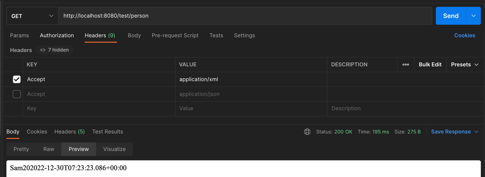
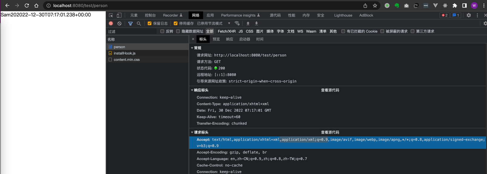

## 内容协商
添加依赖
```xml
<!-- 添加xml转换依赖，（请求头为Accept:application/xml则返回xml格式），json不需要显示引入，因为SpringBoot已默认导入 -->
<dependency>
    <groupId>com.fasterxml.jackson.dataformat</groupId>
    <artifactId>jackson-dataformat-xml</artifactId>
</dependency>
```
pojo
```java
@Data
public class Person {
    private String username;
    private Integer age;
    private Date birth;
}
```
controller
```java
@Controller
public class ResponseTestController {

    /**
     * 若要让该controller同时支持不同的返回值：如json、xml
     * 返回json -> 请求头带 Accept:application/json -- SpringBoot默认引入了依赖："jackson-dataformat-json"
     * 返回xml  -> 请求头带 Accept:application/xml -- 需要maven手动引入依赖："jackson-dataformat-xml"
     */
    @ResponseBody
    @GetMapping("/test/person")
    public Person getPerson() {
        Person person = new Person();
        person.setUsername("Sam");
        person.setAge(20);
        person.setBirth(new Date());
        return person;
    }
}
```
index.html
```html
<body>
<h1>首页</h1>
<h3>1、测试返回值为json格式 --> "/test/person"</h3>
<textarea style="width: 750px; height: 130px;">
// 浏览器默认请求表头为： Accept: text/html,application/xhtml+xml,application/xml;q=0.9,image/avif,image/webp,image/apng,*/*;q=0.8,application/signed-exchange;v=b3;q=0.9
// 可以看出浏览器xml请求头权重为0.9: application/xml;q=0.9, xml优先级默认比较高，所以浏览器访问返回xml格式内容

// 如下使用 Accept: application/json 返回json内容
curl --location --request GET 'http://localhost:8080/test/person' \
--header 'Accept: application/json'
</textarea>
<hr>
<h3>2、测试返回值为xml格式 --> "/test/person"</h3>
<textarea style="width: 750px; height: 130px;">
// // 如下使用 Accept: application/xml 返回xml内容
curl --location --request GET 'http://localhost:8080/test/person' \
--header 'Accept: application/xml'
</textarea>
<hr>
</body>
```
Postman




