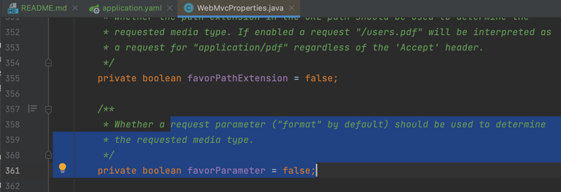
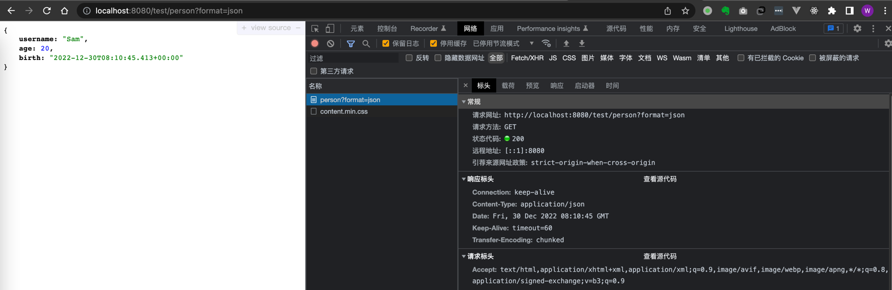
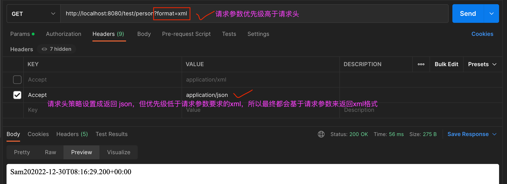

## 内容协商 - 基于请求参数内容协商（让浏览器基于请求参数也能返回json）
添加依赖
```xml
<!-- 添加xml转换依赖，（请求头为Accept:application/xml则返回xml格式），json不需要显示引入，因为SpringBoot已默认导入 -->
<dependency>
    <groupId>com.fasterxml.jackson.dataformat</groupId>
    <artifactId>jackson-dataformat-xml</artifactId>
</dependency>
```
application.yaml开启基于请求参数的内容协商配置
```xml
spring:
  mvc:
    contentnegotiation:
      favor-parameter: true   # 开启基于请求参数的内容协商
```
点击yaml配置属性进入源码查看说明文档，使用format请求参数来决定请求的MediaType，e.g. ?format=json 或 ?format=xml

pojo（不变）
```java
@Data
public class Person {
    private String username;
    private Integer age;
    private Date birth;
}
```
controller（不变）
```java
@Controller
public class ResponseTestController {

    /**
     * 若要让该controller同时支持不同的返回值：如json、xml
     * 返回json -> 请求头带 Accept:application/json -- SpringBoot默认引入了依赖："jackson-dataformat-json"
     * 返回xml  -> 请求头带 Accept:application/xml -- 需要maven手动引入依赖："jackson-dataformat-xml"
     */
    @ResponseBody
    @GetMapping("/test/person")
    public Person getPerson() {
        Person person = new Person();
        person.setUsername("Sam");
        person.setAge(20);
        person.setBirth(new Date());
        return person;
    }
}
```
index.html（基于请求参数）
```html
<body>
<h1>首页</h1>
<a th:href="@{/test/person?format=json}">1、测试返回值为json格式 --> "/test/person?format=json"</a><br>
<textarea style="width: 750px; height: 130px;">
// 如下使用format基于请求参数决定返回类型为json
curl --location --request GET 'http://localhost:8080/test/person?format=json'
</textarea>
<hr>
<a th:href="@{/test/person?format=xml}">2、测试返回值为xml格式 --> "/test/person?format=xml"</a><br>
<textarea style="width: 750px; height: 130px;">
// 如下使用format基于请求参数决定返回类型为xml
curl --location --request GET 'http://localhost:8080/test/person?format=xml'
</textarea>
<hr>
```
浏览器访问(请求头权重不变，但返回json内容) ?format=json



浏览器访问(请求头权重不变，但返回xml内容 ?format=xml


请求头和请求参数都能设置返回值类型，若请求参数和请求头要求的返回数据类型不一致，将以请求参数（优先级更高）为准

