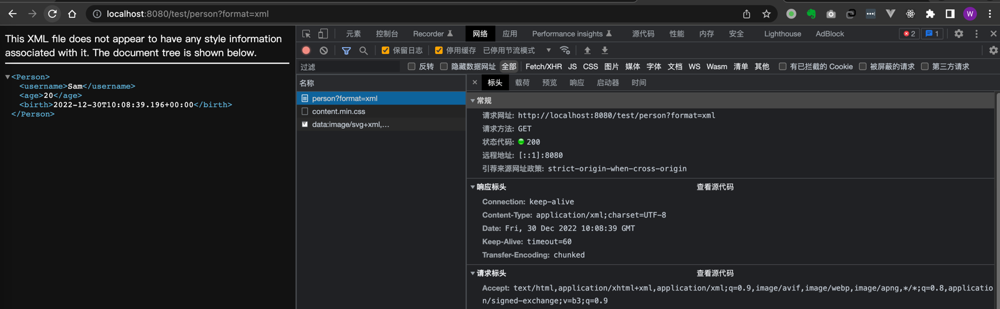

## 内容协商 - 内容协商拓展（自定义请求参数?format=guigu）
添加依赖
```xml
<!-- 添加xml转换依赖，（请求头为Accept:application/xml则返回xml格式），json不需要显示引入，因为SpringBoot已默认导入 -->
<dependency>
    <groupId>com.fasterxml.jackson.dataformat</groupId>
    <artifactId>jackson-dataformat-xml</artifactId>
</dependency>
```
application.yaml开启基于请求参数的内容协商配置
```xml
spring:
  mvc:
    contentnegotiation:
      favor-parameter: true   # 开启基于请求参数的内容协商
```
自定义请求头的converter以及自定义返回内容
```java
public class GuiguMessageConverter implements HttpMessageConverter<Person> {
    @Override
    public boolean canRead(Class<?> clazz, MediaType mediaType) {
        return false;
    }

    @Override
    public boolean canWrite(Class<?> clazz, MediaType mediaType) {
        // 只要方法返回值类型是Person类型就能写
        return clazz.isAssignableFrom(Person.class);
    }

    /**
     * 服务器要统计所有MessageConverter都能写出哪些类型
     * 自定义类型 application/x-guigu
     *
     * @return
     */
    @Override
    public List<MediaType> getSupportedMediaTypes() {
        return MediaType.parseMediaTypes("application/x-guigu");
    }

    @Override
    public Person read(Class<? extends Person> clazz, HttpInputMessage inputMessage) throws IOException, HttpMessageNotReadableException {
        return null;
    }

    @Override
    public void write(Person person, MediaType contentType, HttpOutputMessage outputMessage) throws IOException, HttpMessageNotWritableException {
        // 自定义协议数据的返回内容
        String data = person.getUsername() + ";" + person.getAge() + ";" + person.getBirth();

        // 自定义协议数据的写出
        OutputStream body = outputMessage.getBody();
        body.write(data.getBytes());
    }
}
```
WebConfig.java
```java
@Configuration(proxyBeanMethods = false)
public class WebConfig implements WebMvcConfigurer {
    @Override
    public void configureMessageConverters(List<HttpMessageConverter<?>> converters) {
        // 【请求头方式的内容协商拓展】添加自定义的Converter到列表中
        converters.add(new GuiguMessageConverter());
    }

    @Override
    public void configureContentNegotiation(ContentNegotiationConfigurer configurer) {
        // 【请求参数方式的内容协商拓展】
        // 配置format请求参数支持的媒体类（format key, format mapped MediaType请求头）
        Map<String, MediaType> mediaTypes = new HashMap<>();
        // SpringBoot默认支持的配置，因为我们重写，所以需要加进去
        mediaTypes.put("json", MediaType.APPLICATION_JSON);
        mediaTypes.put("xml", MediaType.APPLICATION_XML);
        // 新增的自定义请求参数支持的类型： ?format=guigu, 对应映射的请求头为 "Accept： application/x-guigu"
        mediaTypes.put("guigu", MediaType.parseMediaType("application/x-guigu"));
        // 指定支持解析哪些参数对应哪些媒体类型
        ParameterContentNegotiationStrategy strategy = new ParameterContentNegotiationStrategy(mediaTypes);
        configurer.strategies(Arrays.asList(strategy));
    }
}
```
pojo（不变）
```java
@Data
public class Person {
    private String username;
    private Integer age;
    private Date birth;
}
```
controller（不变）
```java
@Controller
public class ResponseTestController {

    /**
     * 若要让该controller同时支持不同的返回值：如json、xml
     * 返回json -> 请求头带 Accept:application/json -- jacksonJsonConverter -- SpringBoot默认引入了依赖："jackson-dataformat-json"
     * 返回xml  -> 请求头带 Accept:application/xml -- jacksonXmlConverter -- 需要maven手动引入依赖："jackson-dataformat-xml"
     * 返回自定义数据类型（拓展） --> 请求头带 application/x-guigu -- 自定义xxxConverter 
     */
    @ResponseBody
    @GetMapping("/test/person")
    public Person getPerson() {
        Person person = new Person();
        person.setUsername("Sam");
        person.setAge(20);
        person.setBirth(new Date());
        return person;
    }
}
```
index.html（基于请求参数）
```html
<body>
<h1>首页</h1>
<a th:href="@{/test/person?format=guigu}">1、基于自定义请求参数，返回自定义内容格式 --> "/test/person?format=guigu"</a>
<textarea style="width: 750px; height: 130px;">
curl --location --request GET 'http://localhost:8080/test/person?format=guigu'
    
// Response - 自定义返回内容，使用";"分割
Sam;20;Fri Dec 30 17:01:59 CST 2022
</textarea>
<hr>
<a th:href="@{/test/person?format=json}">2、基于一般请求参数，返回json内容格式 --> "/test/person?format=json"</a>
<textarea style="width: 750px; height: 130px;">
curl --location --request GET 'http://localhost:8080/test/person?format=json'

// Response - json
{"username":"Sam","age":20,"birth":"2022-12-30T09:07:31.835+00:00"}
</textarea>
<hr>
<a th:href="@{/test/person?format=xml}">2、基于一般请求参数，返回xml内容格式 --> "/test/person?format=xml"</a>
<textarea style="width: 750px; height: 130px;">
curl --location --request GET 'http://localhost:8080/test/person?format=xml'

// Response - xml
Sam202022-12-30T09:06:54.639+00:00
</textarea>
<hr>
</body>
```
browser - 自定义请求参数(?format=guigu) - 映射成自定义请求头(Accept: application/x-guigu)返回自定义格式内容


browser - 一般json请求参数(?format=json) - 映射成一般请求头(application/json)返回json格式内容


browser - 一般json请求参数(?format=xml) - 映射成一般请求头(application/xml)返回xml格式内容


